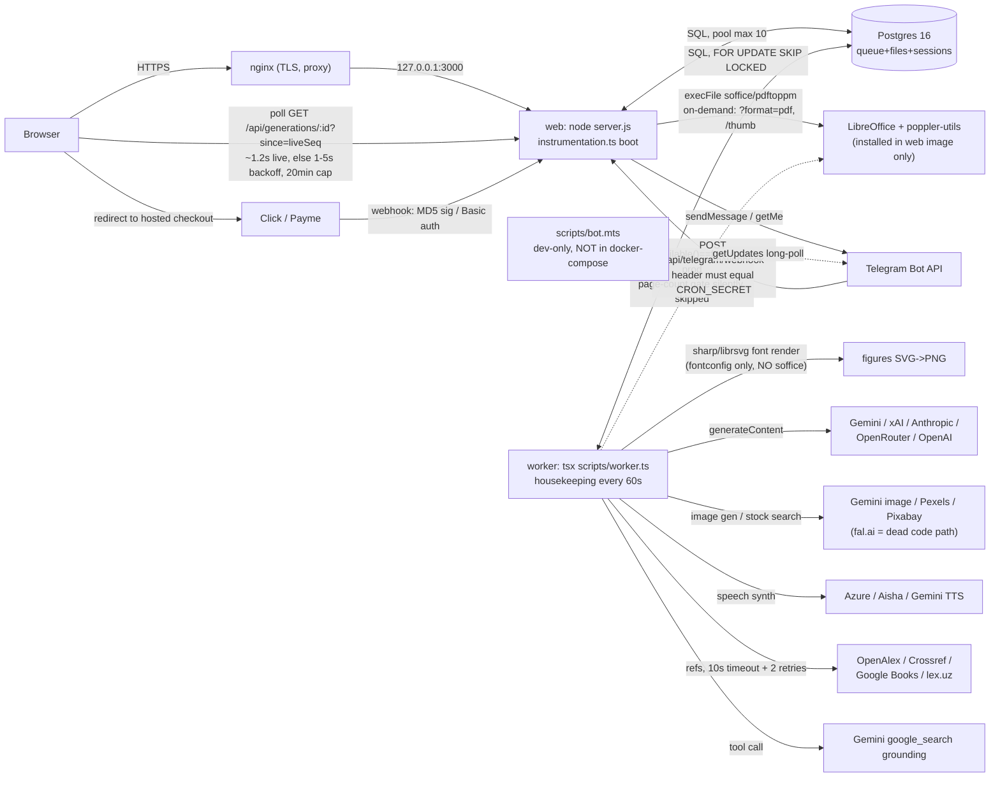

# 01 — Map

**Date:** 2026-09-23. **Method:** every claim below was checked directly against source
(Read/grep), not copied from the scout notes. Scout notes (`audit/scout/*.md`) were used
as a starting index only; where they were wrong or imprecise this map corrects them
in place (see §6). Citations are `path:line` against the working tree at the audit
baseline commit (`76ddf91`, branch `audit/production-readiness`).

## 1. Stack & versions

Resolved (locked) versions from `package-lock.json`:

| Package | Version | Role |
|---|---|---|
| next | 15.5.23 | App Router, standalone output |
| react / react-dom | 19.1.0 | UI |
| pg | 8.23.0 | Postgres driver, `Pool` |
| docx | 9.7.1 | DOCX render (`render-docx.ts`) |
| pptxgenjs | 4.0.1 | PPTX render (`render-pptx.ts`) |
| sharp | 0.34.5 | Raster (photos, SVG→PNG figures, thumbnails) |
| unpdf | 1.8.0 | PDF page-count read (page gate), PDF text extract |
| jszip | 3.10.1 | OOXML (DOCX/PPTX/XLSX) zip read/write |
| katex | 0.16.47 | Formula render (viewer + OMML source) |
| @anthropic-ai/sdk | 0.125.0 | LLM provider adapter (`llm/anthropic.ts`) |
| zustand | 5.0.15 | Client state (`lib/store.ts`, `lib/ui.ts`) |
| tsx | 4.23.12 | Runs worker/bot/scripts (no separate TS build step for them) |
| typescript | 5.9.3 | devDependency |

**Node base image:** `node:22-alpine` — all four Dockerfile stages (`deps`, `builder`,
`runner`, `worker`) (`Dockerfile:4,10,21,71`).

**Runtime entrypoints / processes:**

| Process | Entry | How started | Notes |
|---|---|---|---|
| web | `node server.js` (`Dockerfile:65`) | Docker target `runner`; `.next/standalone` output | Boots via Next.js `instrumentation.ts:7-41` — runs `ensureMigrated()`, then `startInlineWorker()` **only if** `WORKER_INLINE=true` (prod sets `"false"`, `docker-compose.yml:93`) |
| worker | `tsx --conditions=react-server scripts/worker.ts` (`Dockerfile:117`) | Docker target `worker`, always runs `runWorkerProcess()` (`scripts/worker.ts:10-15` → `lib/server/worker.ts:408-416`) regardless of `WORKER_INLINE` | Separate image; has full source + `tsx` (web's standalone bundle doesn't) |
| bot (dev) | `tsx scripts/bot.mts` (`npm run bot`) | Manual, long-polling `getUpdates` | **Not in `docker-compose.yml`, no Dockerfile stage** — dev-only per its own header comment (`scripts/bot.mts:1-9`) |
| bot (prod) | `POST /api/telegram/webhook` inside **web** | Telegram calls this URL after an out-of-band `setWebhook` (not called anywhere in this repo — grep for `setWebhook` finds only a doc-comment, `app/api/telegram/webhook/route.ts:17`) | Same `handleUpdate()` (`lib/server/telegram.ts:337`) as the dev poller |
| migrations | `ensureMigrated()` (`lib/server/db.ts:139-148`) | Runs lazily, memoized per-process, on first call from instrumentation boot, worker loop start, and every API route via `requireUser`/`optionalUser`/`requireAdmin` (`lib/server/api.ts:137,151`) | Advisory lock `pg_advisory_lock(727000001)` serializes concurrent appliers (`db.ts:105`); manual `npm run db:migrate` (`scripts/migrate.ts`) exists but deploy.md says it's not required |
| cron/purge | `housekeeping()` (`lib/server/worker.ts:324-366`) | Plain `setInterval`-driven loop inside the **worker** process only (`worker.ts:368-390`, every 60 s) — not OS cron | Calls `reclaimStaleJobs`, `purgeExpiredSessions`, `purgeExpiredGameSessions`, `purgeRateLimits`, `purgeExpiredTickets`, `purgeOldSources(30)`, `purgeOldPhotos(90)`. If the `worker` container is down, none of this runs (web never calls it) |
| admin scripts | `scripts/topup.mts`, `scripts/seed-demo.mts`, `scripts/seed-images.mts` | Run via `docker compose -p slaydx exec worker npx tsx ...` (`.claude/deploy.md:122-129`) | Only the `worker` image has `tsx`+full source; seed scripts go through real `enqueueGeneration`, never direct SQL |

## 2. Architecture

Notes on edges not obvious from the diagram: the worker's outbound `HEAD` request to
grounding-supplied URLs (`slide-research.ts:167`, scheme-checked but no private-IP
filter — SSRF surface, low severity since URLs come from Gemini, not the end user)
is omitted above for clarity.

**External API inventory** (endpoints re-verified against source, not copied from the
scout notes — two corrections found and marked below):

| Group | Provider | Endpoint | Timeout / retry | Key env var | Evidence |
|---|---|---|---|---|---|
| LLM | Gemini | `POST …/v1beta/models/{model}:generateContent` (+ `:streamGenerateContent`) | 40s, 3 retries on 429/5xx | `GEMINI_API_KEY` | `lib/generation/llm.ts:254-255,396-398` |
| LLM | xAI | `POST api.x.ai/v1/chat/completions` | 40s/25s variants, 3 retries | `XAI_API_KEY` | `llm.ts:533,673-675` |
| LLM | Anthropic | Anthropic SDK, `v1/messages` | SDK `timeout: opts.timeoutMs`, `maxRetries: 1` | `ANTHROPIC_API_KEY` | `llm/anthropic.ts:94` |
| LLM | OpenRouter | `POST openrouter.ai/api/v1/chat/completions` | caller `timeoutMs` via AbortSignal | `OPENROUTER_API_KEY` | `llm/openrouter.ts:31,33` |
| LLM | OpenAI | `POST api.openai.com/v1/chat/completions` | caller `timeoutMs` via AbortSignal | `OPENAI_API_KEY` | `llm/openai.ts:31,33` |
| Image | Gemini image | `POST …/v1beta/interactions` — **correction**: scout claimed the `:generateContent` models path; the actual constant is a distinct `/interactions` endpoint | 40s, no retry | `GEMINI_API_KEY` | `image-provider-gemini.ts:40,185` |
| Image | Pexels | `GET api.pexels.com/v1/search` | `AbortSignal.timeout(budget)`, no retry | `PEXELS_API_KEY` | `image-provider-pexels.ts:19,57` |
| Image | Pixabay | `GET pixabay.com/api/` | `AbortSignal.timeout(budget)`, no retry | `PIXABAY_API_KEY` | `image-provider-pixabay.ts:14,58` |
| Image | fal.ai (dead code) | `POST fal.run/{model}` — **correction**: host is `fal.run`, not `fal.ai` | `AbortSignal.timeout(budget)` | `FAL_KEY` | `image-provider-fal.ts:43,79`; not reachable from any live tool (`project_slaydx_fal_credit_env_tests`) |
| TTS | Gemini TTS (preview) | `…/v1beta/models/{model}:streamGenerateContent` | per-call budget | `GEMINI_API_KEY`+`TTS_GEMINI_MODEL` | `tts/gemini.ts:32` |
| TTS | Azure | `POST {region}.tts.speech.microsoft.com/cognitiveservices/v1` | `AbortSignal.timeout(timeoutMs)` | `AZURE_SPEECH_KEY`+`_REGION` | `tts/azure.ts:50,170` |
| TTS | Aisha | `POST back.aisha.group/api/v1/tts/post/` | per-call, retryable-status classification | `AISHA_API_KEY` | `tts/aisha.ts:29,31,92` |
| Research | OpenAlex | `GET api.openalex.org/works` | **10s timeout + 2 retries, exponential backoff** — **correction**: scout marked this "no timeout"; it shares a timed HTTP layer | none (optional `OPENALEX_MAILTO`) | `openalex.ts:17,134,158` via `research/http.ts:28,69-76` |
| Research | Crossref | `GET api.crossref.org/works` | same shared 10s/2-retry layer — same correction | optional `CROSSREF_MAILTO` | `crossref.ts:17,85,134` |
| Research | Google Books | `GET www.googleapis.com/books/v1/volumes` | own `BOOKS_TIMEOUT_MS`, same `getJson` helper — same correction | `GOOGLE_BOOKS_API_KEY` | `googlebooks.ts:29,130` |
| Research | lex.uz | No REST API; LLM proposes candidate acts, each cross-checked against a `lex.uz/docs/<id>` page fetch | not on the shared `http.ts` layer — timeout not independently confirmed | none | `lexuz.ts:38,95-97` |
| Grounding | Gemini search tool | Same Gemini chat endpoint, `tools:[{google_search:{}}]` | 40s, 3 retries (inherits Gemini path) | `GEMINI_API_KEY` | per scout `llm.ts:191`, not re-verified independently |
| Payments | Click / Payme | inbound webhooks only, no outbound calls from this app | n/a | `CLICK_*`/`PAYME_*` | `lib/server/payments.ts` |
| Telegram | Bot API | `sendMessage`/`getMe`/`setMyCommands`, 15s timeout | n/a | `TELEGRAM_BOT_TOKEN` | `lib/server/telegram.ts:24-47` |

The OpenAlex/Crossref/Google Books correction matters for production readiness: the
scout notes' "research APIs can stall a job indefinitely" risk is **not accurate** —
all three are timeout- and retry-bounded, so worst case they add ~30s (10s × (1
timeout + 2 retries)), not an unbounded hang.

## 3. Critical user flows

### (a) Signup / login

| # | Step | Evidence |
|---|---|---|
| 1 | Telegram widget/Mini App → `POST /api/auth/telegram` | `app/api/auth/telegram/route.ts:25-51` |
| 2 | CSRF (`checkOrigin`: `Sec-Fetch-Site`/`Origin` match) + IP rate limit `tg:${ip}` 20/300s | `route.ts:27,33`; `lib/server/api.ts:64-107` |
| 3 | Signature verified server-side, bot-token-keyed HMAC-SHA256; client `id` never trusted | `lib/server/auth.ts:36-99` (`verifyLoginWidget`/`verifyMiniAppInitData`) |
| 4 | `upsertTelegramUser` — find-by-`telegram_id` or create + 3000-point signup bonus, both in one tx | `auth.ts:108-138` (`SIGNUP_BONUS_POINTS=3000`, `auth.ts:15`) |
| 5 | `createSession` — 32 random bytes, SHA-256 hash stored, raw token → httpOnly cookie `slaydx_session` | `session.ts:166-196` |
| — | **Bot-initiated variant**: `POST /api/auth/telegram/ticket` makes a nonce (`ticket/route.ts:23-32` → `telegram.ts:92-105`); user opens `t.me/<bot>?start=<nonce>`; bot's `handleUpdate` calls `attachTicket` (`telegram.ts:123-135`) binding nonce→one-time token; `GET /api/auth/telegram/enter?t=` redeems it (`enter/route.ts:27-63` → `telegram.ts:174-205`), no CSRF check needed (not a browser-originated request) | |
| — | **DM-first variant**: user messages the bot directly (`/start`, `/login`) with no nonce → `createBotLoginLink` (`telegram.ts:151-161`) issues ticket+token in one INSERT, bot sends the `enter` link itself | |
| — | **OTP/dev login**: `POST /api/auth/otp` gated by `DEV_LOGIN_ENABLED` (default `!isProd`, off in prod) — `otp/route.ts:39-44`; 5-digit code, HMAC-SHA256 hashed, 2-min TTL, 5 attempts max | `auth.ts:159-208` |
| — | Session read-back: `currentUser()` joins `sessions`+`users`, rejects `is_blocked` and expired/revoked rows; admin flag recomputed every read from phone, not stored on the session | `session.ts:214-236,110` |

### (b) Main generation (form → file)

| # | Step | Evidence |
|---|---|---|
| 1 | `POST /api/generations`, `requireUser`, burst+hourly rate limits (5/60s, 60/3600s) | `app/api/generations/route.ts:29-34` |
| 2 | `sanitizeValues`, server-side required-field + preflight checks | `route.ts:47,94-101` |
| 3 | Translation only: `sourceChars` recomputed server-side from the uploaded asset or literal text length — client value discarded | `route.ts:63-85` |
| 4 | `price = priceFor(tool, values)` — server-only, client `price` ignored | `route.ts:103`; `lib/tools.ts:1392` |
| 5 | `enqueueGeneration` — **one transaction**: `chargeInTx` (points→quota→balance split, idempotent on `(kind,reference)`) then `INSERT INTO generations` | `lib/server/jobs.ts:159-193` |
| 6 | Insufficient funds → 402 with required/available, nothing charged or queued | `route.ts:119-125` |
| 7 | If `WORKER_INLINE`, wake the inline loop for this request | `route.ts:128`; `worker.ts:397-401` |
| 8 | Worker `claimJob` — `UPDATE … WHERE id=(SELECT … FOR UPDATE SKIP LOCKED)` | `jobs.ts:341-380` |
| 9 | `runJob` calls `buildArtifact(tool, values, {deadline,…})` (engine dispatch per tool, `lib/generation/index.ts`) | `worker.ts:162-308` |
| 10 | Bytes → `putGenerationFile` (Postgres BYTEA, upsert) + `putAssets` | `worker.ts:251-256`; `lib/server/storage.ts:31-61` |
| 11 | `completeJob` — **only** if `locked_by` still equals this worker's id | `jobs.ts:405-438` |
| 12 | Client polls `GET /api/generations/:id?since=liveSeq`; `mergeLive`/`nextPollDelay` — 1.2s while `live`+`IN_PROGRESS`, else 1-5s backoff | `app/api/generations/[id]/route.ts:28-43`; `lib/api-client.ts:291,302,367` |
| 13 | Viewer renders `doc_json` via the shared layout models (`planSlide`/`planArticle`/`planWork`/… ) — same model DOCX/PPTX renderer reads ("ko'rdim = oldim", `CLAUDE.md`) | |
| 14 | Download `GET /api/generations/:id/file` — `ensureFreshFile` rebuilds PPTX first if `file_version < doc_version` | `file/route.ts:33-93`; `lib/server/slide-commit.ts:278-287` |
| 15 | `?format=pdf` → `toPdf()` (LibreOffice `execFile`) run **synchronously inside the web process**, `maxDuration=60` | `file/route.ts:70-93,9`; `lib/server/pdf.ts:44-88` (see §6.vi) |

### (c) File upload & export

| Upload | Route | Limit | Storage |
|---|---|---|---|
| Translation source | `POST /api/uploads/source`, `maxDuration=60`, rate limit `source:${user.id}` 20/600s | 20 MB, sniffed, PDF page cap; auth+rate-limit only in the route, real work in `uploadSource()` | `source_uploads.bytes` (30-day purge, `worker.ts:356`) |
| Resume photo | `POST /api/uploads/photo`, `maxDuration=30`, rate limit `photo:${user.id}` 20/300s | 5 MB, cropped via `sharp` in `uploadPhoto()` | `user_photos.bytes` (90-day purge, `worker.ts:362`) |
| Custom PPTX template | `POST /api/uploads/template` | 20 MB, ZIP-sniffed, rasterized via LibreOffice **in the web process** (scout-sourced, `app.md`, not independently re-read) | `template_uploads.bytes` (no purge — permanent) |
| Slide logo | `POST /api/uploads/logo` | 2 MB, PNG/SVG sniff (scout-sourced) | `logo_uploads.bytes` (no purge) |
| Extract (form helper) | `POST /api/extract` | `Content-Length` pre-check before `formData()`, output capped | not stored — returned inline |

Source and photo routes were re-read directly (`app/api/uploads/source/route.ts:1-28`,
`app/api/uploads/photo/route.ts:1-19`) — both are thin: auth + rate limit only, all
validation/storage logic lives in `lib/server/source-upload.ts`/`photo.ts`. All four
storage tables use a per-user primary key or `assetId` and are read back through
`getAsset`/equivalent with a `user_id` SQL predicate — same ownership pattern verified
directly in `lib/server/storage.ts` for `generation_files`. Export path is flow (b)
step 15 (DOCX/PPTX native, PDF on-demand, PNG for the `image` tool as a ZIP when
multiple images).

### (d) Payments, limits, free endpoints

| # | Step | Evidence |
|---|---|---|
| 1 | `POST /api/payments/orders` → `createOrder`, bounds 5,000–10,000,000 so'm | `lib/server/payments.ts:181-200` |
| 2 | Client redirected to Click/Payme hosted checkout (outside this repo) | |
| 3 | `POST /api/payments/click` — Prepare/Complete, MD5 `clickSignatureValid` | `payments.ts:53-67`; `app/api/payments/click/route.ts:76-` |
| 4 | `POST /api/payments/payme` — `Authorization: Basic Paycom:<key>`, SHA-256+timing-safe compare | `payments.ts:76-106` |
| 5 | `settleOrder` — idempotent on `reference = provider:providerTxn`; `topUp`/`activatePro` write a ledger row under the same unique `(kind,reference)` constraint used by generation charges | `payments.ts:276-311` |
| — | Rate limits: Postgres `rate_limits` table, atomic single-statement UPSERT (§6.iii) | `lib/server/ratelimit.ts:21-50` |
| — | Free LLM helpers, no credit debit: `/api/outline` (12/600s/user), `/api/article/udk` (30/3600s/user), `/api/generations/:id/rewrite` (20/600s/user), `/api/generations/:id/polish` (20/day/user **and** 3/day/doc) | rate figures per `audit/scout/app.md`, endpoints confirmed present in route listing (`app/api/{outline,article/udk,generations/[id]/{rewrite,polish}}/route.ts`) |

### (e) Admin

| # | Step | Evidence |
|---|---|---|
| 1 | `requireAdmin` = `currentUser()` + `isAdminPhone(user.phone)` against a **hardcoded** list (`ADMIN_PHONES = ["+998XXXXXXXXX"]`) — no DB column involved | `lib/server/admin.ts:15-23`; `lib/server/admin-phones.ts:17,34-37` |
| 2 | Non-admin gets 404, not 403 (hides that the panel exists) | `admin.ts:21` |
| 3 | `GET/PATCH/PUT /api/admin/users[/:id]` — search/paginate, wallet adjust (`adminAdjustWallet`, journaled), block toggle; **no rate limit** on any admin route (trusts the hardcoded gate) | `app/api/admin/users/route.ts:34-85`; `[id]/route.ts:13-80` |
| 4 | Becoming admin in Telegram: user DMs bot `/admin`, shares contact, bot writes `users.phone` then re-checks `isAdminPhone` live (no persisted admin flag) | `lib/server/telegram.ts:296-335,358-371` |
| 5 | Admin CLI (topup/seed) run inside the `worker` container, through real `enqueueGeneration`/`credits.ts` functions, never raw SQL (project convention) | `.claude/deploy.md:116-134` |

## 4. Where state lives

| State item | Location | Owner | Shared across processes | Survives restart | 2+ web replicas |
|---|---|---|---|---|---|
| Sessions | Postgres `sessions.token_hash` | any | yes | yes | safe |
| Job queue + status/progress | Postgres `generations` | worker writes, web reads | yes | yes | safe |
| Generated file bytes | Postgres `generation_files.bytes` (BYTEA) | worker writes, web reads | yes | yes | safe |
| Media assets | Postgres `generation_assets.bytes` | worker | yes | yes | safe |
| Rate-limit counters | Postgres `rate_limits` | any | yes | yes | safe |
| Credit ledger | Postgres `users.{points,quota,balance}` + `transactions` | any (in tx) | yes | yes | safe |
| UI prefs (theme/locale/dir) | browser `localStorage: slaydx-ui` | browser | no (per device) | yes | n/a, client-only |
| DB pool | process memory `globalThis.__slaydxPool` | every process | no | no | safe — each replica opens its own pool (≤`DATABASE_POOL_MAX`) |
| Migration-ran guard | process memory `globalThis.__slaydxMigrated` | every process | no | no | safe — idempotent SQL + advisory lock |
| Inline-worker-started guard | process memory `globalThis.__slaydxWorker` | web (if `WORKER_INLINE`) | no | no | safe by design — each replica may run its own inline worker |
| Worker concurrency counter / shutdown flag | process memory, `running`/`stopped` (`lib/server/worker.ts:55-56`) | worker (or inline web) | no | no | safe by design — total concurrency scales with replica count intentionally |
| **Thumbnail semaphore + dedup cache** | process memory, `inflight`/`active`/`waiters` (`lib/server/thumb.ts:81-83`) | **web** | **no** | no | **caveat** — see below |
| Source-cache store handle | process memory, `override`/`dbStore` (`lib/generation/research/cache.ts:29,53`) | worker | no (but backing rows are in Postgres `source_cache`) | no | safe — actual cached payloads are DB-resident, these vars only memoize which store to call |
| Live progress (`live_json`) | Postgres `generations.live_json`/`live_seq` | worker writes, web reads | yes | yes (cleared on completion) | safe |
| Per-job progress ticker | process memory, per-job `setInterval` | worker | no | no | safe — ephemeral, cleared in `finally` (`worker.ts:117,306`) |

**Module-level state grep** (`new Map(`/`new Map<`, `setInterval(`, `setTimeout(`, column-0 `let`) across `lib/server/**`, `app/**`, `lib/generation/**`:

| Hit | What | Matters? |
|---|---|---|
| `lib/server/thumb.ts:81` `const inflight = new Map<string, Promise<Buffer\|null>>()` | Per-process de-dup cache keyed `userId:generationId`, entries deleted in `.finally()` | Only within-process de-dup; harmless duplicate work across replicas, not a correctness bug |
| `lib/server/thumb.ts:82-83` `let active = 0; const waiters = []` | Hand-rolled semaphore, `MAX_PARALLEL=2` LibreOffice conversions at a time | **Per-replica**, not global — real concurrent `soffice` processes scale with replica count, uncapped cluster-wide |
| `lib/server/worker.ts:55-56` `let running = 0; let stopped = false` | Job-loop concurrency counter / SIGTERM flag | Intentional per-process semantics |
| `lib/generation/research/cache.ts:29,53` `let override; let dbStore` | Lazy singleton for "which cache backend" (test seam / DB store handle) | Benign — see table above |
| `lib/server/db.ts:16-17,26-51` `__slaydxPool`, `__slaydxMigrated` | Already covered above | Standard, expected |
| `lib/server/live.ts:164` `this.timer = setTimeout(...)` | Per-`LiveReporter`-instance (one per in-flight slide job), not module-level | No |
| ~90 other `new Map(`/`new Map<` hits | All function-scoped locals (e.g. `render-pptx.ts:182` `imageCache` lives for one render call) | No |
| ~20 other `setTimeout(` hits | Sleep helpers, per-request abort timers, or per-call polish timeouts | No |
| ~250 other column-0-adjacent `let` hits | All 2-space-indented, i.e. function-local, not module scope | No |

**Verdict on the scout claim "no in-memory user state, safe for 2+ web replicas":
PARTLY.** No user-*identifying* data lives in memory anywhere (confirmed). But
`lib/server/thumb.ts` holds real per-process concurrency/dedup state invisible to
other replicas — a scaling/resource-planning caveat, not a correctness bug. Every
other piece of mutable state that matters for correctness (queue, files, sessions,
credits, rate limits) is Postgres-backed and replica-safe.

## 5. Configuration

Variable **names** only; defaults are from code, prod values are the `docker-compose.yml`
references (no secret values shown).

| Var | Code default | Prod (docker-compose.yml) | Effect |
|---|---|---|---|
| `WORKER_INLINE` | `true` (`env.ts:204`) | `"false"` for `web` (`docker-compose.yml:93`); the `worker` service ignores this var and always runs the loop | Web also runs jobs, or not |
| `WORKER_CONCURRENCY` | `2` (`env.ts:200`) | `${WORKER_CONCURRENCY:-2}` (`:155`) | Parallel jobs per worker process |
| `WORKER_JOB_TIMEOUT_MS` | `660000` (`env.ts:91,202`) | `${WORKER_JOB_TIMEOUT_MS:-660000}` (`:156`) | Fallback lease timeout for pre-`budget_ms` rows only |
| `DATABASE_POOL_MAX` | `10` (`env.ts:112`) | not set — code default applies | `pg.Pool({max})` (`db.ts:29`) |
| `FILE_TTL_HOURS` | **not read anywhere in app code** | `${FILE_TTL_HOURS:-72}` (`:86`) | **Dead** — expiry removed by `011_no_expiry.sql`; only referenced in `docs/AUDIT-6.md` and a comment in `scripts/seed-demo.mts` |
| `TRUST_PROXY` | `false` (`env.ts:142`) | `${TRUST_PROXY:-true}` (`:91`) | Whether `x-forwarded-for` is honoured for IP-keyed rate limits |
| `SESSION_TTL_DAYS` | `30` (`env.ts:115`) | `${SESSION_TTL_DAYS:-30}` (`:88`) | Cookie/row lifetime |
| `SESSION_COOKIE_SAMESITE` | `lax` (`env.ts:130-132`) | `${SESSION_COOKIE_SAMESITE:-lax}` (`:87`) | `none` needed for Telegram Mini App iframe (requires HTTPS) |
| `SESSION_SECRET` | throws in prod if unset/<32 chars (`env.ts:52-64`) | `${SESSION_SECRET:?required}` (`:36,111`) — compose itself refuses to start without it | Session hashing/HMAC key |
| `DEV_LOGIN_ENABLED` | `!isProd` (`env.ts:148`) | not set — default `false` in prod; `assertRuntimeConfig` throws if `true` in prod | Passwordless OTP bypass |
| `CRON_SECRET` | `""` (`env.ts:196`) | `${CRON_SECRET:-}` (`:85`) | Telegram webhook auth; webhook 503s if unset |
| `STORAGE_DIR` | `.data/files` (`env.ts:181`) | not in compose | **Dead** — zero other references in the codebase; all file bytes are in Postgres |

## 6. Known facts — resolved

| # | Claim | Verdict | Evidence |
|---|---|---|---|
| i | `requireAdmin` = DB flag OR hardcoded list | **FALSE** (the "DB flag" half) | Hardcoded list only: `admin.ts:15-23` → `isAdminPhone` → `admin-phones.ts:17` `ADMIN_PHONES=["+998XXXXXXXXX"]`. No `is_admin` column exists — `lib/server/migrations/001_init.sql:4-31` (users table) has only `is_blocked` (line 31). `session.ts:110` recomputes admin status from phone on every session load; nothing persists an admin bit. |
| ii | Can a reclaimed job still be running in the original worker? | **TRUE**, with a related write-ordering gap | `reclaimStaleJobs` (`jobs.ts:481-521`) only flips the DB row after a timeout — it never cancels the original worker's in-flight `buildArtifact` call (no shared AbortController; `deadline` is cooperative, checked by generation code itself). `completeJob`/`failJob`/`setProgress`/`setLive`/`heartbeat` all require `locked_by=$2 AND status='IN_PROGRESS'` (`jobs.ts:263-322,405-473`), so a late zombie's `completeJob` fails (`won=false`) and `worker.ts:265-272` deletes what it just wrote. **Gap**: `putGenerationFile`/`putAssets` (`worker.ts:251-256`) run *before* that ownership check and have no `locked_by` guard of their own — a slow zombie can overwrite a legitimately-completed second attempt's file, which the zombie's own subsequent failed-`completeJob` cleanup then deletes. Narrow, not exercised under normal load, but real as written. |
| iii | Rate-limit storage (DB vs memory) and atomicity | **TRUE** | `ratelimit.ts:21-50` — Postgres `rate_limits` table, single `INSERT … ON CONFLICT (bucket,window_start) DO UPDATE SET hits=hits+1 RETURNING hits`, atomic per Postgres UPSERT semantics, correct across all replicas. |
| iv | Telegram webhook route's authentication | **TRUE** | `app/api/telegram/webhook/route.ts:28-36` — 503 if `CRON_SECRET` unset; else timing-safe (`safeEqual`) compare of `x-telegram-bot-api-secret-token` against it. The app never calls `setWebhook` itself (grep found none — registration is a manual/out-of-band step). No `bot` service in `docker-compose.yml`, no bot stage in `Dockerfile`; `scripts/bot.mts` long-polling is explicitly dev-only (`scripts/bot.mts:1-9`) — production Telegram traffic flows only through this route inside `web`. |
| v | Where generated file bytes are stored / how downloads read them | **TRUE** | `storage.ts:31-61` `putGenerationFile` → `generation_files.bytes BYTEA`; `getGenerationFile` (`storage.ts:69-86`) reads via ownership-checked SQL JOIN straight into the HTTP response (`file/route.ts:115-125`). No disk I/O for user files. `STORAGE_DIR` env var exists in `env.ts:181` but is otherwise unreferenced anywhere — vestigial. |
| vi | Does PDF conversion run inside the web process on request? | **TRUE**, plus one more discovered nuance | `file/route.ts:70-93` calls `toPdf()` (`pdf.ts:44-88`, `execFile(soffice,…)`) synchronously in the GET handler (`maxDuration=60`); same for thumbnails (`thumb.ts`, web-only route). `Dockerfile:29-48` installs LibreOffice+poppler **only** in the `runner` (web) stage; the `worker` stage (`Dockerfile:71-80`) installs only fonts, no `soffice`. **Consequence**: the in-engine page-count quality gate (`lib/generation/index.ts:751`, runs inside `buildArtifact` in the **worker** process) evaluates `pdfAvailable()` false in production and is silently skipped every time — the code's own comment (`index.ts:734-738`) calls this an intentional fail-open, but it means the LibreOffice page-count gate `CLAUDE.md` describes is currently a no-op in the deployed topology. |
