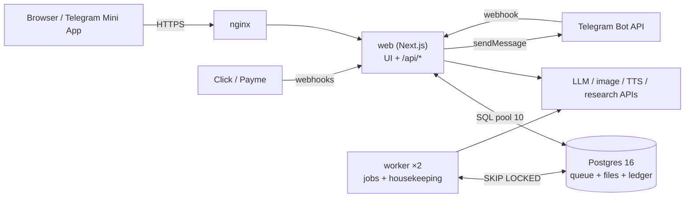
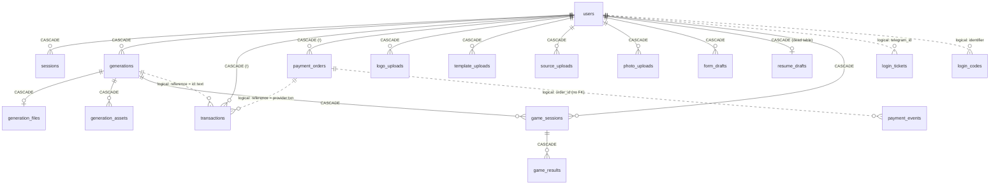
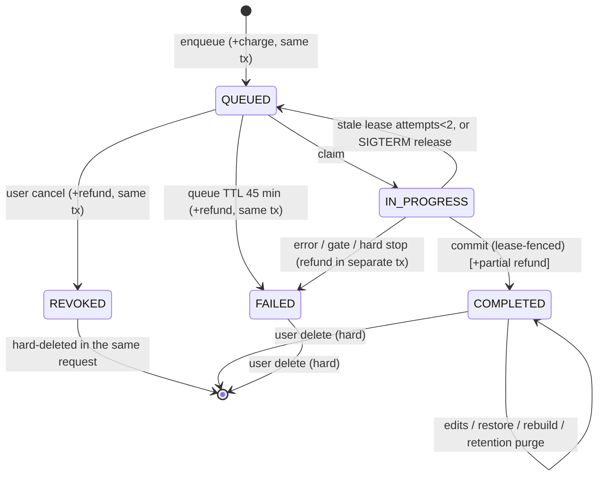

# Admin panel — Phase 1: Deep analysis

**Date:** 2026-10-01 · **Baseline commit:** `857b8b8` · **Status:** read-only analysis, no code changed.

**Method.** Nine read-only analysts each covered one area: architecture, data, auth, flows, money, integrations, API, frontend and ops. Their reports were then cross-checked against the source. Wherever two reports disagreed or a claim carried weight, the cited lines were re-read directly; §9 lists what was verified that way. Every claim below cites `path:line` at the baseline commit. Earlier notes in `audit/` were used only as an index; where they are wrong, §10 says so.

Short forms: `M/0NN` = `lib/server/migrations/0NN_*.sql`.

---

## 0. Executive summary

- **What the product is.** SlaydX is a Next.js 15 App Router web app with a separate queue worker, running on PostgreSQL 16 with raw `pg` and no ORM. It generates educational documents with AI: 23 tools covering slides, coursework, essays, articles, resumes, translation, games, TTS audio and images (`lib/tools.ts:337`). Users log in only through Telegram. Money comes in through Click and Payme top-ups and Pro purchases, and is spent from three wallets (`points`, `quota`, `balance`).
- **An admin panel already exists, but it is minimal.** It is one page (`components/admin/AdminPage.tsx`, 286 lines), backed by four endpoints in two route files (`app/api/admin/users/route.ts`, `app/api/admin/users/[id]/route.ts`). It can search users, adjust wallets and block or unblock users.
  - Admin identity is a phone allow-list, taken from the `ADMIN_PHONES` env var or, failing that, a number hardcoded in the repo (`lib/server/admin-phones.ts:34-41`).
  - There are no roles, no audit table, no 2FA, no rate limits and no admin session separate from the user's 30-day cookie.
- **The operator cannot see or do most of what a launch needs.** Jobs and the queue, payments and orders, refunds, AI cost, provider health, background tasks, errors, public game links (moderation) and settings all live only in logs, CLI scripts (`scripts/metrics-report.mts`, `scripts/cost-report.mts`, `scripts/topup.mts`) or env vars that need a container restart.
- **Security defects in the existing admin code** (all verified):
  1. The admin's phone number leaks to end users. It is written into the transaction note, which the user's profile ledger then displays (`app/api/admin/users/[id]/route.ts:68` → `lib/server/credits.ts:386` → `components/profile/ProfilePage.tsx:175`).
  2. Wallet adjustment is not idempotent: each call uses a random reference (`lib/server/credits.ts:385`), and the UI has no confirmation step.
  3. Block and unblock are not audited at all (`app/api/admin/users/[id]/route.ts:79-93`). `Boolean("false")` evaluates to true, so sending the string blocks the user (`:83`), and an admin can block themselves.
  4. The list endpoint's `page` parameter is unvalidated, so a malformed value produces a 500 (`app/api/admin/users/route.ts:39`).
- **The quality gate: intermittent in CI, red in this analysis container.**
  - On GitHub Actions, the PR carrying these docs (`857b8b8` + docs; run `36878593554`) passed **every** step: typecheck, lint, test, test:viewer, test:ui and build.
  - CI's `npm run test` step is **intermittent**. The next head, `eb7e134`, differs from the green run only in docs text, yet failed 4 of 3520 tests (run `36879797584`). The three earlier push runs on `main` also failed at this step. The 4 tests are not yet identified, because the reachable log is truncated.
  - In this container: `npm test` has 93 failing results (84 top-level "not ok" in 36 files) and `test:ui` has 29. Typecheck, lint and `test:viewer` are green, and every DB-backed money, auth, admin and queue test passes against real Postgres 16.
  - The container failures are environment-specific. Causes are in §8.1: tsx module identity and a broken LibreOffice. The Definition of Done is therefore **CI fully green**, which may need the intermittent tests found and fixed first, plus no new local failures beyond §8. See Q3.

---

## 1. System map

### 1.1 Processes

| Process | Entry | Notes |
|---|---|---|
| web | `node server.js`, the Next standalone build (`Dockerfile:91`) | The boot hook `instrumentation.ts:7-69` checks env (and exits in prod if it is invalid), runs `ensureMigrated()`, and starts an inline worker only when `WORKER_INLINE` is set. That flag is off in prod (`docker-compose.yml:213`). |
| worker × 2 replicas | `tsx --conditions=react-server scripts/worker.ts` (`Dockerfile:153`) | `runWorkerProcess()` (`lib/server/worker.ts:1147-1160`). Concurrency is 4 per replica (`docker-compose.yml:232-233,318`). The worker also runs housekeeping about every 60 s (`lib/server/worker.ts:63,1036-1043`). |
| Telegram bot | prod: webhook `POST /api/telegram/webhook` in web. dev: `scripts/bot.mts` long-poll | Both call `handleUpdate` (`lib/server/telegram.ts:337`). |
| postgres 16 | compose service, internal only (`docker-compose.yml:9,85-86`) | Stores everything, file bytes included (BYTEA). `STORAGE_DIR` is never read (`lib/server/env.ts:205`). |
| nginx (host) | template `deploy/nginx/slaydx.conf.example` | The only ingress. Web is bound to `127.0.0.1` (`docker-compose.yml:218`). |
| backups (host cron) | `scripts/backup.sh` | Status goes to a log file on the host only (`scripts/backup.sh:52-53,177-178`). |

### 1.2 Layers and conventions

These are the house style that admin code must follow.

| Layer | Path | Rule |
|---|---|---|
| Pages | `app/uz/**` | A thin server page that renders one `"use client"` component (`app/uz/profile/page.tsx:1-5`). Every `/uz` page is wrapped in `AppShell` (`app/uz/layout.tsx:1-5`). |
| API | `app/api/**/route.ts` (43 files) | Each file sets `runtime = "nodejs"` and `dynamic = "force-dynamic"`, and wraps every method in `handler(scope, fn)` (`lib/server/api.ts:211-235`). Expected failures are thrown as `ApiError(uzMessage, status, extra)` (`api.ts:70-78`). The wire error format is `{error, ...extra}` plus an `x-request-id` header, and a 500 never reveals the cause in prod (`api.ts:29-43`). |
| Server logic | `lib/server/*.ts` | `import "server-only"` (`api.ts:1`), relative imports, raw SQL with `query`/`queryOne`/`transaction` (`lib/server/db.ts:150-195`), `$n` parameters only. |
| Validation | `lib/server/validate.ts` | Hand-written, with no schema library. `parseIntParam` must be used for numeric parameters so that bad input gives a 4xx, never a 500 (`validate.ts:106-113`; enforced by `tests/malformed-route-params.test.mts`). `readJson(req, cap)` enforces a body cap (`api.ts:246-261`). |
| Logging | `lib/server/log.ts` | One JSON line per call, with request, user and job context from AsyncLocalStorage, and automatic redaction of secrets and phone numbers (`log.ts:3-27,80-119,197-236`). |
| Env | `lib/server/env.ts` | Every new variable must also be passed through `docker-compose.yml` and locked by `tests/compose-env.test.mts`. |
| Migrations | `lib/server/migrations/NNN_name.sql` | Numbered with three digits, contiguous with no gaps (`tests/migrations.test.mts:28-51`). The next file is **`028_*`**. Each file runs in one transaction under advisory lock `727000001` (`db.ts:198,317-323`), so `CREATE INDEX CONCURRENTLY` is not possible. Migrations are additive and forward-only, and each file carries a commented rollback block plus `SET LOCAL lock_timeout = '5s'`. |
| Client API | `lib/api-client.ts` (`request()`) | New feature APIs go in their own files; precedent is `lib/api-edit.ts` (`lib/api-client.ts:120-123`). |
| Tests | `tests/*.test.mts` (flat glob!), `tests/ui/*.test.mts` (jsdom), `tests/viewer/*.test.mts` | Test files in subfolders of `tests/` silently never run (`package.json:11`). |
| UI copy | Hard-coded Uzbek | `tests/ui-strings.test.mts:25-37` rejects English text in `aria-label`, `title`, `placeholder` and `alt` under `components/**` and `app/uz/**`. |
| Code comments | Uzbek JSDoc, with the reason and audit IDs | Precedent: `lib/server/api.ts:23-28`. **This conflicts with the brief**, which asks for English comments. Admin code will use English comments, as the brief instructs. |

Architectural test guards that admin code must pass: `client-bundle-guard`, `client-boundary` (new entries must be added by hand), `bundle-split`, `ui-strings`, `malformed-route-params`, `cache-headers`, `migrations`, `compose-env`, `no-pii-in-repo` and `jsonb-writes` (architecture report §9).

### 1.3 Stack versions (resolved)

next 15.5.26, react 19.1.0, typescript 5.9.3, pg 8.23.0, tailwindcss 4.3.3 with shadcn-style tokens (`app/globals.css:20-127`), zustand 5.0.15, lucide-react 1.31.0, tsx 4.23.12, node 22.

There is no ORM, no zod, no UI kit, no chart library, no table library, no date library and no i18n library. `package.json:30-48` lists the dependencies.

---

## 2. Domain glossary

| Term | Meaning | Evidence |
|---|---|---|
| **Tool** (`tool_id`) | One of the 23 generators, such as `slide`, `pro-slide`, `coursework`, `translation` or `crossword`. | `lib/tools.ts:337-920` |
| **Generation / job** | A row in `generations`: one paid generation request and its whole lifecycle. | `M/001:65-98` |
| **Tanga** | The internal coin; prices are in tanga. A top-up credits 1 tanga per 1 so'm. | `lib/server/payments.ts:120-121` |
| **Points ("Ball")** | Bonus wallet. Every signup gets 3 000. Docs paid with points are second-class: purged after 180 days and excluded from free AI edits. | `lib/server/auth.ts:16`; `lib/server/retention.ts:67-129`; `lib/server/spend.ts:211-251` |
| **Quota ("Kvota")** | Pro wallet. Each Pro purchase adds 15 000. It **never expires**: `plan_expires_at` changes only the label. | `lib/server/payments.ts:114-118`; `lib/server/session.ts:83-84` |
| **Balance ("Balans")** | Real-money wallet, funded by top-ups. | `lib/server/payments.ts:391-399` |
| **Charge order** | A charge drains points first, then quota, then balance, inside the same transaction as the job insert. | `lib/server/credits.ts:29-37,73-120`; `lib/server/jobs.ts:298-336` |
| **Ledger** | The `transactions` table, with kinds `charge`, `refund`, `topup`, `bonus`, `subscription`, `admin_credit` and `admin_debit`. It is idempotent on `(kind, reference)`. | `M/008:29-30`; `M/001:130-131` |
| **Pro** | Costs 15 000 so'm for 30 days plus 15 000 quota. Its advertised "queue priority" is **not implemented**. | `lib/server/payments.ts:114-118`; `components/purchase/PurchasePage.tsx:15`; `lib/server/jobs.ts:794-800` |
| **Order** | A row in `payment_orders`, moving `created → pending → paid \| cancelled`. Provider times are stored as **ms epoch BIGINT** (`app/api/payments/click/route.ts:104`). | `M/001:134-152`; `M/005:14-23` |
| **Payment event** | The raw, redacted body of every authenticated webhook, kept for 365 days. | `M/025:30-45`; `lib/server/payment-events.ts:77-93` |
| **Admission** | The 429 check before charging: per-user in-flight limit of 2, plus a queue-wait estimate of up to 900 s. | `lib/server/admission.ts:76-104`; `lib/server/env.ts:262-268` |
| **Budget / hard stop** | Each job's time budget (90 s to 660 s). The job fails at budget + 15 s, but the build itself may keep running as an **orphan**. | `lib/generation/budget.ts:316-380`; `lib/server/worker.ts:307,439-471` |
| **Lease** | `locked_by` = `workerId:uuid`. Every commit is fenced by it. | `lib/server/jobs.ts:741-743,911-962` |
| **Reconcile** | A sweep that refunds FAILED jobs which were charged but not refunded. It looks back **2 days only**. | `lib/server/refund-reconcile.ts:317-368` |
| **Retention purge** | Deletes the content of points-only COMPLETED jobs after 180 days and sets `files_purged_at`. | `lib/server/retention.ts:67-129` |
| **Game share / token** | A public, unrevocable 30-day link (`/o/<token>`) to a playable generation. Anonymous players submit `game_results`. | `lib/server/game-sessions.ts:24-37,118-142` |
| **Free LLM** | Outline, UDK, rewrite and polish. These have no price, but daily caps and a kill switch via `FREE_LLM_DISABLED` (env). | `lib/server/spend.ts:49-121` |
| **cost_json** | Per-job AI cost telemetry in USD, broken down by kind, provider and model. It is written **only on success**. | `M/020:9`; `lib/generation/job-cost.ts:59-146`; `lib/server/worker.ts:562-566` |
| **Breaker** | Per-provider circuit breaker. It lives **in process memory**, separately in each process. | `lib/generation/llm/breaker.ts:24-27,129-146` |
| **Admin (today)** | A user whose `phone` matches `ADMIN_PHONES`, or the hardcoded fallback number. The phone is written only by the bot's `/admin` contact-share flow. | `lib/server/admin-phones.ts:34-84`; `lib/server/telegram.ts:455-501` |

---

## 3. Entities and relations

### 3.1 ER diagram (effective schema after 001–027)

Every real foreign key uses `ON DELETE CASCADE`, **including those from `users` to `transactions` and to `payment_orders`** (`M/001:117,136`). There are no RESTRICT or SET NULL foreign keys.

### 3.2 Entity catalogue

| Entity | Key columns, status fields and constraints | Size and lifetime | Evidence |
|---|---|---|---|
| `users` | `id BIGSERIAL`, `telegram_id UNIQUE`, `username`, `name`, `local_id` (partial UNIQUE), `phone` (partial UNIQUE), wallets `points`/`quota`/`balance` (CHECK ≥ 0), `plan IN (free,pro)`, `plan_expires_at`, `is_blocked`, 10 profile/form-default text fields, `created_at`, `updated_at` (no trigger) | never deleted; no `deleted_at` | `M/001:4-34`; `M/006:14,20`; `M/008:11-12`; `M/015:5-6` |
| `sessions` | `token_hash UNIQUE` (SHA-256), `user_agent`, `ip_hash`, `last_seen_at`, `expires_at`, `revoked_at` | purged 7 days after expiry or revocation | `M/001:38-50`; `lib/server/session.ts:258-270` |
| `login_codes` | dev OTP: `identifier`, `code_hash`, `attempts`, `consumed_at` | purged 1 day after expiry | `M/001:53-62` |
| `login_tickets` | Telegram nonce, `token_hash`, `telegram_id`, `attempts`, `consumed_at` | purged 1 h after expiry | `M/004:13-25`; `M/007:17` |
| `telegram_updates` | `update_id` PK (dedup) | 1 day | `M/004:28-32` |
| `generations` | `id UUID`, `user_id`, `tool_id` (no CHECK), `topic`, **`status IN (QUEUED, IN_PROGRESS, COMPLETED, FAILED, REVOKED)`**, `price`, `progress`, `step`, `error`, `attempts`, `locked_by`/`locked_at`, `run_after`, `budget_ms`, `started_at`/`finished_at`, JSONB `values_json`, `doc_json`, `doc_prev`, `live_json`, `preview`, `delivered_json`, `cost_json`, `html`, `doc_version`/`file_version`/`live_seq`, `image_redraws`, `edited_at`, `files_purged_at`, `idempotency_key` | rows are kept unless the user deletes them (hard DELETE). Rows are wide (TOAST). | `M/001:65-98` + 003, 009, 010, 013, 014, 020, 022, 024, 027 |
| `generation_files` | PK `generation_id`, `file_name`, `mime`, `size_bytes`, **`bytes BYTEA`**, `downloads` | kept forever for paid jobs | `M/001:102-112`; `M/011` |
| `generation_assets` | PK `(generation_id, asset_id)`, `mime`, `size_bytes`, `bytes BYTEA` | same as files | `M/002:8-18` |
| `transactions` | `kind` CHECK (7 values), `points_delta`/`quota_delta`/`balance_delta`, `reference` (logical link), `note`, `created_at`. **No actor column, no metadata, no reason code.** | forever | `M/001:115-131`; `M/008:20-30` |
| `payment_orders` | `provider IN (click, payme)`, `purpose IN (topup, pro)`, `amount_soum > 0`, **`state IN (created, pending, paid, cancelled)`**, `provider_txn`, `create_time`/`perform_time`/`cancel_time` (ms BIGINT), `cancel_reason`, `prepare_id` | forever; abandoned orders are never swept | `M/001:134-152`; `M/005:14-23` |
| `payment_events` | `provider`, `method`, `order_id` (text, no FK), `provider_txn`, `payload` JSONB (redacted), `response_code`, `received_at` | 365 days | `M/025:30-45` |
| view `payment_ledger` | `topup`/`subscription` transactions joined to orders on an unindexed string expression | — | `M/025:47-63` |
| `rate_limits` | PK `(bucket, window_start)`, `hits` | 25 h | `M/001:155-161`; `lib/server/ratelimit.ts:94-99` |
| `logo_uploads` | PK `(user_id, asset_id)`, BYTEA | **never purged** (`purgeUnusedUploads` is not wired up) | `M/012:10-18`; `lib/server/worker.ts:903-906` |
| `template_uploads` | PK `(user_id, asset_id)`, `name`, BYTEA, `profile`/`previews` JSONB | never purged | `M/016:9-19` |
| `source_uploads` | translation sources: `kind`, `mime`, BYTEA, `chars` (price basis), `text` | 30 days | `M/017:20-36` |
| `photo_uploads` | resume photos: `kind (crop\|original)`, `crop` JSONB, BYTEA | 90 days if unreferenced | `M/019:27-42`; `lib/server/photo.ts:229-260` |
| `form_drafts` | PK `(user_id, tool_id)`, `data` JSONB (may hold resume PII) | **never purged** | `M/020:16-22` |
| `resume_drafts` | legacy and **dead**; still holds old PII | never purged | `M/019:21-25`; `M/020:14-15` |
| `source_cache` | research API cache | 60 days | `M/020:32-37` |
| `game_sessions` | `token UNIQUE` (128 bit), `kind` (no CHECK), `settings_json`, `expires_at` (30 days) | expired sessions with no results are purged | `M/021:43-60`; `lib/server/game-sessions.ts:457-463` |
| `game_results` | `player_name` (anonymous, ≤ 40 chars), `score`/`total`/`seconds`, `answers_json`, `ip_hash`, `submission_id` | until the generation is deleted | `M/021:62-77`; `M/026:32-35` |
| `schema_migrations` | `name` PK (filename only, no checksum) | — | `lib/server/db.ts:298-313` |

**Indexes that an admin panel needs and that are missing** (data report §6.2):
- users: by `created_at`, by `is_blocked`, by plan, and substring search. The repo deliberately avoids `pg_trgm` and other extensions (`M/021:44-46`).
- generations, all users: by `created_at`, by `(status, created_at)`, by `tool_id`.
- transactions, all users: by `created_at` and by `(kind, created_at)`.
- payment_orders: by `(state, created_at)` and by `perform_time`.

Today's row counts are tiny, about 100 generations (`audit/DEPLOY-RUNBOOK.md:130`), so these indexes can be added inside a normal migration transaction now. That stops being true once tables grow.

---

## 4. Flows

### 4.1 Signup and login

There are four login paths, and all of them end in `createSession`:

| Path | Code | Verification |
|---|---|---|
| Telegram Login Widget | `app/api/auth/telegram/route.ts:45-93` | HMAC; `auth_date` must be no older than 24 h (`lib/server/auth.ts:37-58`) |
| Mini App `initData` | same route | HMAC; also replayable for up to 24 h (`lib/server/auth.ts:64-100`) |
| Bot ticket / magic link | `/api/auth/telegram/ticket` → bot → `/enter` (confirm page and POST) | single-use HMAC token, 5-minute TTL (`lib/server/telegram.ts:166-309`) |
| Dev OTP | `/api/auth/otp` | blocked in prod: boot exits if it is enabled (`lib/server/env.ts:334-336`; `instrumentation.ts:33-47`) |

Session details:
- The cookie `slaydx_session` holds an opaque 32-byte token. The DB stores its SHA-256.
- It is httpOnly and Secure in prod. `SameSite` comes from env: `lax` by default, `none` is allowed for the Mini App (`lib/server/session.ts:18,156-196`; `env.ts:154-156`).
- Lifetime is 30 days absolute, with **no idle timeout and no rotation** (`session.ts:166-234`).
- A blocked user's session is resolved as logged out on every request, but **only** inside `currentUser()` (`session.ts:228`).
- Login flows, the worker and public game links never check `is_blocked`.

Phone numbers: no login path supplies one. `users.phone` is written only by the bot's `/admin` contact share (`lib/server/telegram.ts:455-501`), so in practice only admins have one.

**Operator needs:**
- see a user's identity: telegram id and username, local id, phone if any, signup date, last seen, and their active sessions;
- revoke a user's sessions;
- see whether login is failing at scale, e.g. ticket issued vs. redeemed (not persisted today).

### 4.2 Generation lifecycle

1. **Enqueue.** `POST /api/generations` (`app/api/generations/route.ts:42-173`):
   - applies rate limits;
   - accepts an optional `Idempotency-Key`;
   - runs `sanitizeValues` and preflight checks;
   - computes the price on the server (`lib/tools.ts:1465-1551`);
   - in **one transaction**: admission check, `chargeInTx`, and an INSERT with status QUEUED (`lib/server/jobs.ts:272-352`).
2. **Claim.** `FOR UPDATE SKIP LOCKED`, FIFO by `created_at`, with a per-user cap. There is no priority (`lib/server/jobs.ts:769-819`).
3. **Run.** `runJob` → `buildArtifact` with a deadline → `setCost` (success only) → `commitJobResult`, fenced by the lease (`lib/server/worker.ts:385-662`; `lib/server/jobs.ts:911-962`).
4. **Failure.** No retry on exceptions. FAILED is committed first, then the refund runs in a **separate** transaction. If that refund fails, the worker logs `alert:"REFUND_FAILED"` (`lib/server/worker.ts:637-661,695-738`).
5. **Partial delivery.** The job stays COMPLETED and a ratio refund is issued. If that refund throws, it is lost (`lib/server/worker.ts:608-660`).
6. **Stale lease.**
   - `attempts < 2`: requeued.
   - Otherwise: FAILED, then refunded (`lib/server/jobs.ts:1005-1055`).
   - Queued for more than 45 minutes: FAILED and refunded in the same transaction (`lib/server/queue-ttl.ts:146-189`).
7. **Cancel.** The user's DELETE first moves QUEUED → REVOKED with a refund in the same transaction, then **hard-deletes** the row together with its files, assets, game sessions and results (`lib/server/jobs.ts:566-616`).
   - REVOKED therefore never persists.
   - IN_PROGRESS jobs **cannot be cancelled** by anyone (`app/api/generations/[id]/route.ts:83-91`).

**Operator needs:**
- **Live queue view:** queued and running counts, oldest queued age, in-flight jobs per user, and worker liveness. Only `/api/health` exposes some of this, behind `CRON_SECRET` (`app/api/health/route.ts:37-60`).
- **Job search** by id, user, tool, status and date.
- **Job detail:** input (`values_json`, PII-masked), progress, attempts, lease, budget, error, delivered, `cost_json`, and the linked ledger rows.
- **Job actions:**
  - cancel and refund a QUEUED job;
  - force-fail and refund a stuck IN_PROGRESS job;
  - manually refund a FAILED job that was charged but not refunded, including ones outside the 2-day reconcile window.
- **Alerts:** `REFUND_FAILED`, failures with a charge but no refund, per-tool failure-rate spikes, 429 / `queue_full` spikes, and orphan builds.

### 4.3 After generation

- Edit, restore, rebuild, AI rewrite and polish (free and capped).
- Download, PDF (via LibreOffice, gated) and thumbnail.
- Uploads: logo, photo, template and source. The user quota is 200 MB, and the numbers are hard-coded and still "pending owner confirmation" (`lib/server/upload-quota.ts:29-46`).
- Form drafts.

Sources: flows report §3–§5.

**Operator needs:**
- per-user storage usage, reusing `USAGE_SQL` (`lib/server/upload-quota.ts:96-120`);
- the ability to view and delete a user's logos and templates, which are never purged;
- free-LLM usage measured against its caps.

### 4.4 Public games (user-generated content)

- `POST /api/generations/:id/share` mints a new 30-day token each time it is called. There is **no revoke** (`app/api/generations/[id]/share/route.ts:43-96`).
- `/o/<token>` shows the user-entered `topic` and the AI content to anyone holding the link (`app/api/o/[token]/route.ts:27-45`).
- Anonymous `player_name` submissions are visible to the owner only. CSV export guards against formula injection (`app/api/generations/[id]/results/route.ts:21-25`).
- **Blocking a user does not disable their links** (`lib/server/game-sessions.ts:166-171`).
- There is no moderation layer at all. The only safety filter is the providers' own (flows report §9).

**Operator needs:**
- a moderation list of active public links (owner, topic, kind, created/expires, result count);
- actions to revoke a link and delete abusive results;
- search across `topic`.

### 4.5 Payments

- **Order creation:** `POST /api/payments/orders` creates an order and returns the checkout URL (`app/api/payments/orders/route.ts:22-62`).
- **Webhook authentication:**
  - Click: MD5 signature plus `service_id`.
  - Payme: Basic auth with a constant-time compare.
  - Sources: `lib/server/payments.ts:55-111`; payme route `:317-323`.
- **Settlement:** `settleOrder` locks the order and credits and marks it paid in **one transaction**, idempotently (`lib/server/payments.ts:351-419`).
- **Cancelling a paid order is impossible.**
  - Payme state −2 does not exist, and `CancelTransaction` on a paid order returns −31007 (`app/api/payments/payme/route.ts:206-210`).
  - Click returns "already paid" (`app/api/payments/click/route.ts:132-133`).
- **No reconciliation exists:**
  - nothing checks paid orders against the ledger;
  - nothing checks wallets against Σ ledger;
  - stale orders are never swept.
- **Revenue data is available:** `payment_orders` filtered to `state='paid'` by `perform_time`. Offline aggregates exist in `scripts/metrics-report.mts:106-128`.

**Operator needs:**
- revenue by day, provider and purpose;
- an order list and order detail (order + `payment_events` + ledger rows);
- a list of orders stuck in pending or created;
- reconciliation alerts;
- a record of external refunds and chargebacks with a wallet clawback (product decision, Q7).

### 4.6 Refunds and wallet adjustments

- **Automatic refunds** cover cancel, queue TTL, failure, stale lease, partial delivery and the 2-day reconcile window.
- **Manual refunds** have no API. The only path today is `psql` plus `credits.refund` (`lib/server/refund-reconcile.ts:36-56`).
- **Admin wallet adjust:** `adminAdjustWallet` (`lib/server/credits.ts:345-400`):
  - runs in a single transaction with `FOR UPDATE`;
  - writes kind `admin_credit` or `admin_debit` with a **random reference**;
  - writes the note as `"admin:<phone>: <note>"`;
  - the UI never sends a note (`components/admin/AdminPage.tsx:43`).
- **`scripts/topup.mts`** credits wallets as kind **`bonus`** with no actor recorded. That makes manual credits indistinguishable from signup bonuses (`scripts/topup.mts:39-45`).

**Operator needs:**
- wallet adjustment with a **mandatory reason**, an idempotency key and confirmation;
- an actor stored separately from the user-visible note;
- a user ledger view that shows the per-wallet split and the reference. Today's `recentTransactions` hides both (`lib/server/credits.ts:412-428`).

### 4.7 Background tasks

Housekeeping runs about every 60 s, inside the worker only:
- `reclaimStaleJobs`, `expireQueuedJobs` and `refundUnrefundedFailed` run in every process.
- The rest run only on the advisory-lock leader `727000002`, every 6 h or every tick: retention purge, payment-event purge, session, ticket, rate-limit, source, photo and source-cache purges (`lib/server/worker.ts:812-1000`).
- Results are reported in logs only.

Ops CLIs: `topup`, `cost-report`, `metrics-report`, `rerender-pptx`, `backfill-preview`. They exist **only in the worker image** (`Dockerfile:130-132`).

**Operator needs:**
- per housekeeping step: last run, result, rows affected and the current leader;
- worker liveness. Today that is a file inside each worker container, invisible to web (`lib/server/worker.ts:74,116`);
- the dashboard equivalents of `metrics-report` and `cost-report`.

### 4.8 AI providers and cost

- **Providers:**
  - LLM via role chains: Gemini, Anthropic, OpenAI, OpenRouter, xAI.
  - Images: Gemini, fal (paid), Pexels, Pixabay.
  - TTS: Azure, Aisha, Gemini.
  - Research: OpenAlex, Crossref, Google Books, lex.uz.
  - Source: integrations report §1–§4.
- **Cost is recorded only partly, in `cost_json`.** It is missing for:
  - failed or abandoned jobs (`lib/generation/job-cost.ts:142-146`; `lib/server/worker.ts:540-548`);
  - the free LLM endpoints;
  - fal images;
  - OpenRouter or unknown models, which are priced at $0 (`lib/generation/llm-pricing.ts:60-65,88-94`);
  - generations deleted by the user, whose cost is lost.
- **Breaker and limiter state** lives per process, in memory, and is not exposed. An operator **cannot see that a provider is down** except by reading the logs of every container.
- **All kill switches are env vars and need a restart.** Several are not even passed through compose: `LLM_STREAM`, `*_POLISH`, `*_ENGINE`, `SOUM_PER_USD` (integrations report §7).
- **A missing LLM key makes the product charge full price for template output** (`lib/tools.ts:1343-1352`; enqueue never calls `toolBlockedReason`).

**Operator needs:**
- AI cost by day, provider, model and tool, with a "telemetry coverage" figure so the operator knows how complete the data is;
- margin computed against **cash** revenue, i.e. balance and quota net of refunds, not `price`;
- provider health and key presence;
- runtime switches: free-LLM off, a per-tool pause, and caps.

### 4.9 Notifications and bot

- `NotificationsPanel` is a static placeholder (`components/overlays/NotificationsPanel.tsx:7-33`).
- The bot sends login and admin-phone messages only (`lib/server/telegram.ts:533-608`).
- It can message any `telegram_id` through `sendMessage` (`lib/server/telegram.ts:125-142`).

**Operator needs:**
- a broadcast or announcement channel, with the channel to be decided (Q9);
- a way to message one user, which would help support.

---

## 5. Operator requirements matrix (per entity)

Legend: **See** = list or detail; **Search** = filters; **Change** = mutations; **Alert** = conditions to surface.

| Entity | See | Search / filter | Change | Alert |
|---|---|---|---|---|
| users | profile, wallets, plan and expiry, phone (masked), sessions, generations, ledger, orders, uploads and storage, game links | id, telegram id, @username, name, phone, local id; blocked; plan; signup date | adjust a wallet (with reason), block/unblock (block can optionally revoke sessions, cancel queued jobs and disable links; Q5), revoke sessions, grant or extend Pro (Q-list) | bulk signups from one IP hash; spend right after signup (bonus abuse) |
| generations | list and detail, as in §4.2 | id, user, tool, status, date range, has-error, unrefunded | cancel+refund (QUEUED), force-fail+refund (stuck), manual refund (FAILED and charged) | failure rate per tool, REFUND_FAILED, stuck > budget, queue age |
| transactions | global ledger with per-wallet split, reference and actor | kind, user, date, reference | none directly; changes go through wallet adjust or refund only | admin adjustments above a threshold |
| payment_orders (+events) | list and detail with the webhook timeline | provider, purpose, state, date, user, txn id | mark an external refund with a clawback (Q7); no state rewrite | pending > 12 h, paid without a ledger row, webhook signature failures |
| AI usage / cost | dashboard by day, provider, model and tool; coverage % | date range, tool, provider | price-table edits are out of scope (Q10) | daily spend above a threshold; unknown-model $0 rows |
| providers | key presence, last success/error, breaker state per process | — | runtime disable (Q8) | provider error-rate spike |
| game_sessions / results | active public links, result counts | owner, kind, topic text, date | revoke a link, delete a result | burst link creation |
| uploads | per-user storage by kind | user | delete a logo or template | DB size growth |
| housekeeping / worker | per-step last run, rows affected, leader, worker heartbeats | — | trigger reconcile now (read-safe), retention dry-run | step failing N times, no leader, worker heartbeat stale |
| errors | persisted server errors (requestId, scope, message, user) | date, scope, level | mark resolved | error-rate spike |
| settings / flags | current effective values (env + DB override) | — | edit runtime overrides (Q8) | — |
| admin accounts | admins, roles, 2FA status, sessions, last login | — | create, disable, change role, reset 2FA, revoke sessions | failed admin logins |
| audit log | every admin mutation, before/after | actor, action, target, date | append-only | — |

---

## 6. Existing admin implementation: full defect list

| # | Defect | Evidence | Severity |
|---|---|---|---|
| A1 | The admin phone leaks to the user in ledger notes. Existing rows already contain `admin:+998…`. | `app/api/admin/users/[id]/route.ts:68`; `lib/server/credits.ts:386`; `app/api/users/me/route.ts:12`; `components/profile/ProfilePage.tsx:175` | High (PII; makes the admin a SIM-swap target) |
| A2 | The admin credential is the user's 30-day cookie, with no idle timeout, no rotation and possibly `SameSite=None`. There is no 2FA. Compromising the Telegram account means admin access. | `lib/server/session.ts:166-234`; `lib/server/env.ts:139-156`; `lib/server/admin.ts:15-23` | High |
| A3 | A hardcoded real admin phone acts as the fallback whenever `ADMIN_PHONES` is unset. | `lib/server/admin-phones.ts:34-41`; `docker-compose.yml:129` | Medium |
| A4 | Wallet adjust is not idempotent and has no confirmation, so a double-click credits twice. | `lib/server/credits.ts:385`; `components/admin/AdminPage.tsx:34-50` | Medium |
| A5 | Block/unblock leaves no audit record. `Boolean("false")` blocks. Admins can block themselves. | `app/api/admin/users/[id]/route.ts:79-93` | Medium |
| A6 | No admin route has a rate limit. `requireAdmin` does not add `userId` to the log context. | `lib/server/admin.ts:15-23` vs `lib/server/api.ts:178` | Medium |
| A7 | `page` is not validated, so it can return a 500. `%` and `_` in the query are not escaped. Phone is not searched. Offset paging has no tiebreak. | `app/api/admin/users/route.ts:39-62` | Low |
| A8 | Admin client code and URLs ship to every user via `lib/store.ts:5` → `lib/api-client.ts:292-336`. | frontend report §11 | Low (information disclosure) |
| A9 | Admin pages inherit the CSP `frame-ancestors` for Telegram and `script-src 'unsafe-inline'`. There is no noindex. | `next.config.ts:47,62`; `app/robots.ts:18` | Medium |
| A10 | No UI test for `AdminPage` and no route tests for list, adjust or block. | `tests/admin.test.mts` covers the lib only | Low |

---

## 7. Risks and technical debt that affect the admin panel

| # | Risk / debt | Impact on the admin panel | Evidence |
|---|---|---|---|
| R1 | **Local test noise.** CI is green (§8), but in this container 93 `npm test` and 29 `test:ui` results fail for environment reasons. | Local runs need the baseline diff in §8 to tell a regression from container noise; CI is the authoritative gate. | §8 |
| R2 | `users` → `transactions` and `payment_orders` use **CASCADE**. | The admin must never hard-delete a user. "Erase" has to mean anonymize. | `M/001:117,136` |
| R3 | Hard deletes of generations remove the evidence. | The admin cannot investigate after a user deletes a job; only orphaned ledger rows remain. | `lib/server/jobs.ts:566-575` |
| R4 | Cost telemetry is incomplete (§4.8). | AI-cost and margin dashboards will **under-report** cost unless the coverage limits are shown, or the product code is changed (Q11). | `lib/generation/job-cost.ts:142-146` |
| R5 | Breaker, limiter and worker liveness live in process memory or files. | A provider-health or worker page needs a new DB heartbeat written from worker code, which is an additive hook. | `lib/generation/llm/breaker.ts:24-27`; `lib/server/worker.ts:74` |
| R6 | All limits and switches are env vars. | Runtime settings require a DB override layer **read by product code**. Defaulting to the env value keeps behavior unchanged. | `lib/server/env.ts:244-289` |
| R7 | There is no persisted error log, and 391 raw `console.*` calls exist. | An error-log page can capture only what flows through `log("error")`, `serverError` and `onRequestError` unless more call sites are migrated. | ops report §2.1 |
| R8 | The shared pool has 10 connections and a 30 s statement timeout. | Admin aggregates must be indexed and bounded, use a READ ONLY transaction, and never `SELECT *` on wide tables. | `lib/server/db.ts:66-88` |
| R9 | No `pg_trgm`; the repo avoids extensions. | Substring search over names needs either an extension (Q13) or bounded prefix and exact matching. | `M/021:44-46` |
| R10 | Migrations run inside a transaction, so `CONCURRENTLY` is impossible. | New indexes lock their tables briefly. That is fine at today's scale but must be noted in the rollout. | `lib/server/db.ts:317-323` |
| R11 | The admin page renders inside the consumer `AppShell`, and `app/error.tsx` unmounts the shell on any error. | An admin layout needs its own `error.tsx`, `loading.tsx` and gate. | `app/uz/layout.tsx:1-5`; `app/error.tsx:137-177` |
| R12 | `scripts/metrics-report.mts` and `cost-report.mts` sit outside the web image. | Their queries must move into `lib/server/` to be reusable, which means editing existing files, or be re-implemented. | `Dockerfile:79-83` |
| R13 | `useDialog` re-runs its effect when the identity of `close` changes. | Admin dialogs must pass a stable `close`. | `components/overlays/useDialog.ts:69` |
| R14 | `cn()` has no `tailwind-merge`. | Admin primitives must expose variant props rather than accept class overrides. | `lib/cn.ts:1-3` |
| R15 | Product defects found during analysis, **not admin scope**: Pro quota never expires; Pro priority is not implemented; a missing LLM key charges full price for template output; IN_PROGRESS jobs cannot be cancelled; partial refunds can be lost; blocked users keep their queued jobs and public links. | Reported here only. The admin panel will make several of them **visible**, but fixing them would change product behavior (Q12). | §4 |
| R16 | `tests/ui-strings` forbids English UI text. | All admin UI copy must be Uzbek. | `tests/ui-strings.test.mts:25-37` |

---

## 8. Baseline: checks at `857b8b8`

Run on 2026-10-01 **in this analysis container**. The failures below do **not** occur in CI; see the CI row in the table. Node 22.22.0, a throwaway Postgres 16.14 with migrations 001–027 applied, and LibreOffice installed but unable to convert anything here. The command recipe is in the ops report and is repeated in `02-plan.md`.

| Check | Result |
|---|---|
| `npm ci` | pass (npm audit: 1 moderate and 5 high vulnerabilities, pre-existing) |
| `npm run typecheck` | **pass** |
| `npm run lint` | **pass** |
| `npm test` with DB | **fail**: 3495 tests, 3396 pass, 93 fail, 6 skipped |
| `npm run test:viewer` | **pass**: 248/248 |
| `npm run test:ui` | **fail**: 477 tests, 448 pass, 29 fail |
| CI (GitHub Actions, run `36878593554` on this PR, `857b8b8` + docs) | **green: all steps pass**, including test:ui and build. **But** run `36879797584` on `eb7e134`, a docs-only change, failed 4/3520 at `npm run test`, and earlier `main` push runs failed at the same step. The CI test step is therefore intermittent, and the failing tests are not yet identified |

### 8.1 Causes of the `npm test` failures

There are three causes.

1. **tsx module identity**, reproduced in a minimal case. When the same module is imported as `./x.ts` in one place and `./x` in another, it loads twice. As a result:
   - `instanceof` checks fail;
   - `?t=` cache-busting re-imports are ignored;
   - `tsx -e` dynamic imports see only `default`;
   - a worker thread cannot resolve extensionless ESM.

   The failure is identical on Node 20, 21 and 22.
2. **LibreOffice cannot convert anything in this sandbox.** The binary exits 0 without producing output. CI does not install LibreOffice, so those tests are skipped there.
3. **The shared DB leaks state** into the research tests through `source_cache`.

Top-level failures (84 "not ok"), by file:

| Failures | Files |
|---|---|
| 12 | `free-llm` |
| 11 | `env-assert-runtime-config` |
| 6 | `parse-pool` |
| 5 | `llm-legacy-deadline` |
| 4 each | `tts-chain`, `tts-azure`, `provider-quota-breaker`, `image-providers-free` |
| 3 each | `template-upload`, `research-openalex`, `research-lexuz` |
| 2 each | `tts-chain-deadline`, `tts-aisha`, `translate-pdf`, `template-busy`, `research-googlebooks`, `research-crossref`, `game-docx`, `env-worker-inline-default`, `admin-phones-env` |
| 1 each | `work-docx`, `upload-body`, `translate-pptx`, `translate-docx`, `thumb`, `teacher-engine`, `teacher-docx`, `slide-research`, `safe-fetch`, `resume-docx`, `research-pipeline`, `render-pptx-template`, `instrumentation-boot`, `article-layout`, `article-engine`, `article-docx` |

### 8.2 `test:ui` failures by file

| Failures | Files |
|---|---|
| 7 each | `home-files`, `result-view-poll` |
| 3 each | `purchase-poll`, `form-draft` |
| 2 each | `topup-cta`, `login-returnto`, `login-popup` |
| 1 each | `theme`, `render-storm`, `confirm-click` |

The root cause has not been traced yet. The leading hypothesis is the same module-identity problem as in §8.1.

**This list is the local regression baseline for this container.** CI must stay fully green. Locally, the admin work must not add a failure to this list and must not remove a test.

---

## 9. Cross-check log

These claims were verified directly in the source:
- **Phone leak:** chain confirmed at `route.ts:68`, `credits.ts:386` and `ProfilePage.tsx:175`.
- **`page` parsing:** `Math.max(1, Number(...) || 1)` at `app/api/admin/users/route.ts:39`.
- **`Boolean(body.blocked)`:** `[id]/route.ts:83`.
- **Block check:** happens only in `currentUser`, at `session.ts:228`.
- **User delete:** a hard `DELETE` that also covers REVOKED rows (`jobs.ts:566-575`).
- **Reconcile window:** parameterised in days (`refund-reconcile.ts:88`).
- **`addLogContext`:** present in `requireUser` (`api.ts:178`) and missing from `requireAdmin`.
- **Telegram framing:** CSP `frame-ancestors` allows Telegram (`next.config.ts:61`).
- **`robots.ts`:** does not disallow `/uz/admin` (`app/robots.ts:18`).
- **Payment time units:** the data analyst marked these as unknown. The handlers pass `Date.now()`, so they are milliseconds (`click/route.ts:104,132,138`; `payme/route.ts:159,189,209`).
- **Page gate:** the admin page gate is at `app/uz/admin/page.tsx:16-19`. One report gave `:20-23`, which was off by four lines.
- **Fallback admin env:** compose passes an empty `ADMIN_PHONES`, so the hardcoded fallback applies (`docker-compose.yml:129,264`).
- **Baseline counts:** re-derived from the run logs.

## 10. Corrections to prior notes

- `audit/scout/app.md` claims an `is_admin` column and an `<AdminGuard>` component. **Neither exists** (`M/008:11-12`; `app/uz/admin/page.tsx:18`).
- `audit/scout/app.md` says the `[id]` route uses UUID validation. **The id is a BIGINT** validated with `parseIntParam` (`app/api/admin/users/[id]/route.ts:19-23`).
- `audit/01-map.md` describes a hardcoded-only admin list. **`ADMIN_PHONES` now replaces it** (`lib/server/admin-phones.ts:36-41`).
- `.env.example` comments about LLM-chain timeouts and the fal fallback are stale (`.env.example:93-98,181-182` versus `lib/generation/image-provider.ts:259` and `lib/generation/llm/chain.ts:243-246`).

---

## 11. Open questions for the owner

These are product decisions that cannot be derived from the code. `02-plan.md` proposes a default for each one, marked **[DEFAULT]**, so planning can continue. Each default needs your confirmation or a correction.

| # | Question | Why it matters |
|---|---|---|
| Q1 | **Roles.** Which admin roles do you need? The proposal is `owner`, `admin`, `support`, `finance`, `moderator` and `viewer`. | Shapes the permission matrix and every endpoint. |
| Q2 | **Admin login.** The proposal is: the existing Telegram identity is required, then the admin must enter a **TOTP** code (authenticator app) to open a separate short-lived admin session. Alternative: a one-time code sent by the Telegram bot. Is an authenticator app acceptable for every admin? | Determines the 2FA design. Telegram-only means a compromised Telegram account is a compromised admin. |
| Q3 | **Test gate.** CI's `npm run test` is intermittent: 4/3520 failures on a docs-only change, and the same failures on earlier `main` runs. The proposed Definition of Done is CI fully green plus zero new local failures against §8. Do you agree? Should finding and fixing the intermittent tests be a separate pre-step? That needs the `not ok` lines from the job log (this session sees only the last 5 000 lines) or a re-run permission. | Defines "tests green". |
| Q4 | **Branch.** You asked for `feat/admin-panel`. This session may push only to `claude/cool-feynman-jiixoi`. Can the work continue on `claude/cool-feynman-jiixoi` (one draft PR), or will you allow `feat/admin-panel`? | Git workflow. |
| Q5 | **Block semantics.** Should a block also revoke sessions, cancel queued jobs (with a refund) and disable public game links? Today it only rejects the session. | Additive admin action vs. product behavior. |
| Q6 | **User erasure.** Is a "delete / erase user" action needed (anonymise PII, keep the ledger), or only blocking? A hard delete would wipe the financial ledger through CASCADE. | Legal / PII. |
| Q7 | **Paid-order refunds.** These are currently impossible: no Payme state −2, and paid orders cannot be cancelled. Should the admin be able to *record* an external refund or chargeback and claw back the wallet, without touching the provider protocol? | Money action, policy. |
| Q8 | **Runtime settings.** Which env knobs should be editable at runtime from the admin, with the env value as the default? Candidates: `FREE_LLM_DISABLED` and its daily caps, a per-tool pause, a "pause all new paid jobs" switch, `USER_MAX_INFLIGHT`. This requires small read-hooks in product code. | Changes the product code footprint. |
| Q9 | **Broadcasts.** Should the admin send announcements? Options: (a) a Telegram bot message to users who have a `telegram_id`; (b) an in-app banner (the notifications panel is a placeholder); (c) both; (d) not now. Any opt-out policy? | Spam/compliance; new UI in the product. |
| Q10 | **Pricing.** Should tool prices or the Pro price be editable from the admin? Prices live in code and are also computed on the client (`lib/tools.ts:1465-1551`). The proposal is to show them read-only and not edit them. | Large product change. |
| Q11 | **AI cost accuracy.** Should the worker also persist cost for failed and abandoned jobs, plus the free-LLM endpoints, into a new append-only `ai_usage` table? This is a small additive change to the worker and `spend.ts`. Without it, the dashboard shows only successful-job cost, with a coverage warning. | Accuracy of the margin report vs. touching product code. |
| Q12 | **Product defects** (R15): fix in separate PRs, or only report them? The proposal is to report them only, and fix none in the admin scope. The exception is **A1, the phone leak**: the proposal is to stop writing the phone into new notes and to scrub existing `admin:+…` notes with an additive data migration. Approve? | The hard rule says not to change existing behavior, but A1 is a security fix. |
| Q13 | **Search.** May `CREATE EXTENSION pg_trgm` be used? The repo currently avoids extensions. Without it, the proposal is exact match on id, telegram id, phone and @username, plus prefix match on name. | Search UX vs. a DB dependency. |
| Q14 | **Network restriction.** Will you also restrict `/uz/admin` and `/api/admin/` to an IP allow-list in nginx? That would be an ops step on the host; a template is provided. | Defence in depth. |
| Q15 | **Audit and error log retention.** The proposal: audit log kept forever (append-only), error log for 90 days. | Storage. |
| Q16 | **Existing CLI scripts.** Should `scripts/topup.mts` be switched to the audited admin path (kind `admin_credit` + actor), or left alone? | Consistency of the ledger. |
