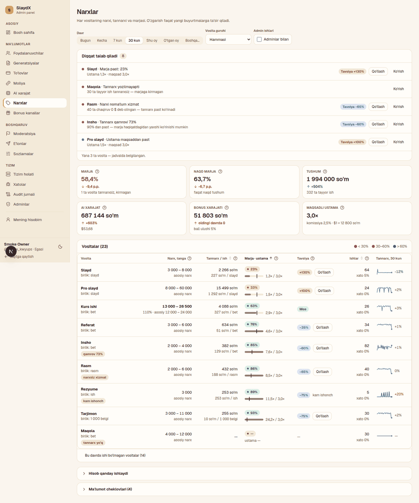
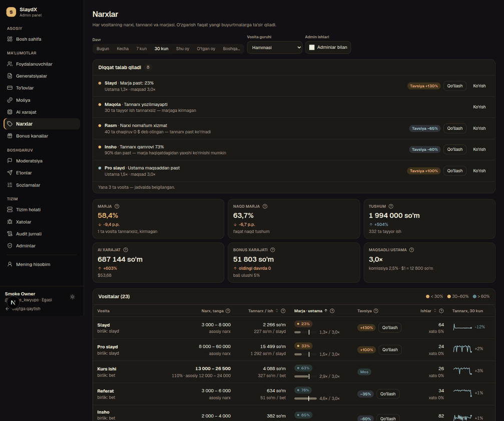
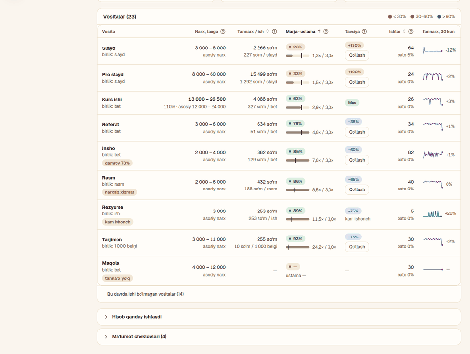
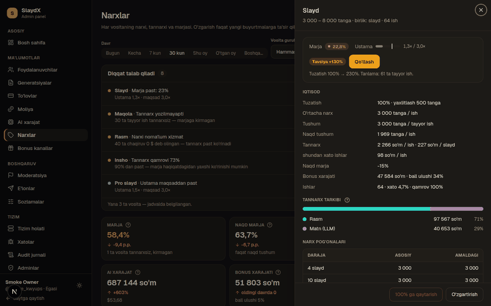
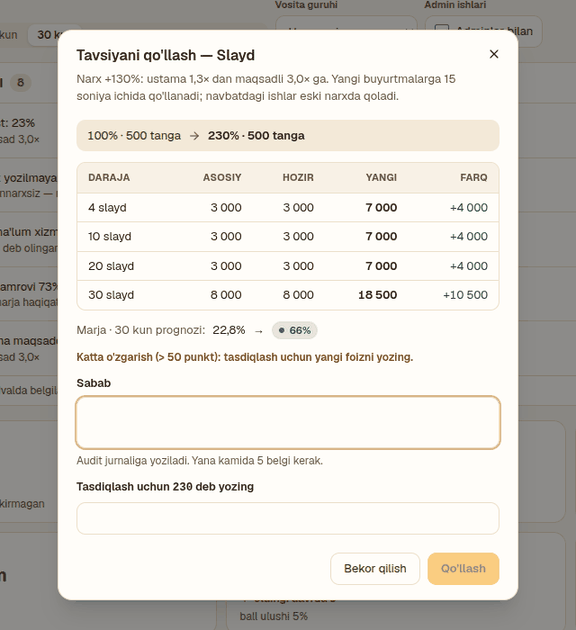
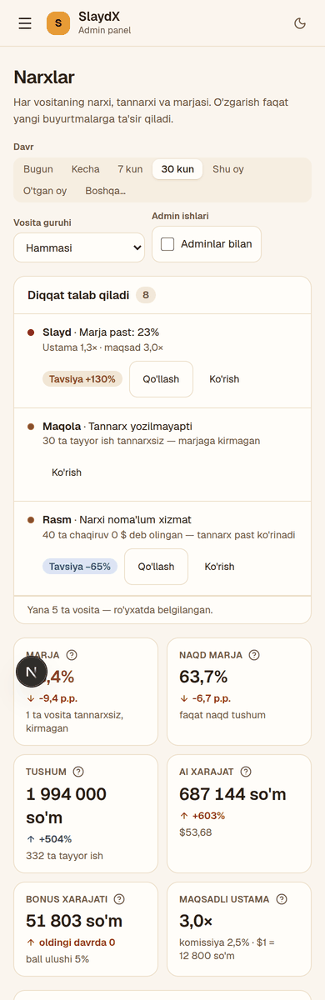
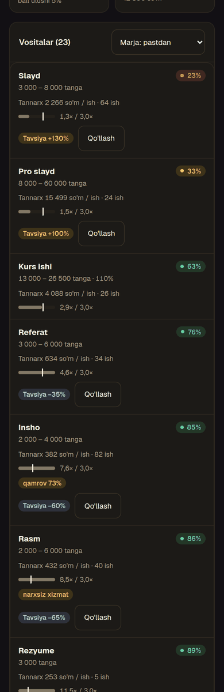
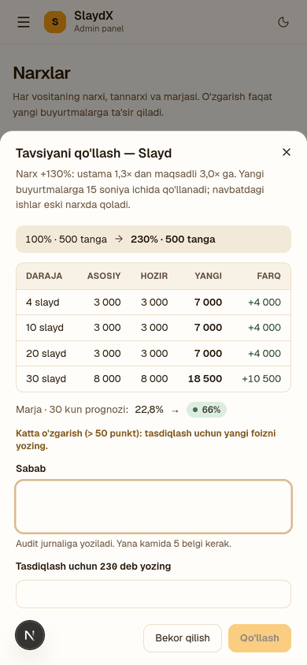

# «Narxlar» redesign — decision panel (2026-10-10)

Owner brief: «admin paneldagi narxlar bo'limini ko'rib qaytadan redesign qilish, strukturalarini yaxshilash va
professional qilish». Owner decisions (2026-10-10): (1) the page is a **decision panel** — the top answers «what
needs my attention / what should I change», numbers second; (2) **phone matters** — tool cards and bottom-sheet
editing on small screens, a full table on desktop; (3) **one-click recommendation** per tool — before/after ladder
and margin, confirm with a reason, audited through the existing `pricing.edit` endpoint, step-up as today, one tool
at a time, no bulk apply.

Formulas are NOT changed (`lib/server/admin-pricing.ts` module comment stays the source of truth): primary «Marja»
= completed jobs' listed price − full cost − payment fee (fee on the cash share only); «Naqd marja» = cash only;
«Bonus xarajati» = AI cost of jobs paid with points; admin jobs excluded unless `?admins=1`; markup and
`recommendedPercent` are fee-adjusted; prices in tanga (1 tanga = 1 so'm), cost USD → so'm via `finance.soum_per_usd`.

## 1. Audit of the current page (main @ f3cb05a)

| # | Problem | Evidence |
|---|---|---|
| P1 | **No «what to do».** The page opens with 8 equal-weight KPI tiles; 3 of them are settings (FX, target markup, fee), one («Marja < 30% vositalar») repeats the table colouring. The admin has to scan a 22-row table to find a problem. | `PricingPage.tsx:248-272` |
| P2 | **Wall of text.** ~140 words of formula prose under the table, long KPI hints (one is 3 clauses), a coverage sentence, a 5-line simulator footnote with the rounding formula in code notation, explanations inside the drawer's key/value rows. | `PricingPage.tsx:252-267, 274-291, 335-351`; `Simulator.tsx:289-296`; `PricingDrawer.tsx:301,319` |
| P3 | **Table too dense.** 8 columns, 3-line cells (cash margin + bonus + points share stacked), a hint line under every header; a code comment admits it only just fits the 956 px card at 1280. Secondary signals (cash margin, bonus, points share) compete with the decision columns. | `PricingTable.tsx:88-90, 128-144` |
| P4 | **Margin vs markup vs cash margin are unclear.** Three ratios side by side; the recommendation is derived from markup but rendered under the margin; «Tuzatish ▲ 120%» reads like a trend arrow, not a price setting. | `PricingTable.tsx:76-87, 112-127` |
| P5 | **Recommendation has no path to act.** It is only a chip («+145% tavsiya» = adjust points, not a price change). To follow it the admin opens the drawer → «O'zgartirish» → types the number by hand. | `PricingTable.tsx:24-37`, `PriceEditDialog.tsx` |
| P6 | **Recommendation can mislead after a mid-period price change.** `recommendedPercent = current% × target ÷ markup`, but `markup` is measured on jobs charged at the *old* price. If the price changed inside the period, applying it compounds the change (100 % → 200 %, reload → 400 %). Nothing in the UI says so. | `admin-pricing.ts:727-732` |
| P7 | A row patched after a save keeps the overview's `recommendedPercent` — no hint that the chip is now based on old data. | `PricingPage.tsx:205-208` |
| P8 | **No concurrency guard.** PUT has no precondition: a second admin's change made after the first opened the dialog is silently overwritten (only «unchanged → 409»). | `admin-pricing.ts:1243-1249` |
| P9 | Data gaps are hidden: tools with jobs but **no cost data** are named only inside the Marja tile hint; **unpriced services** only inside the caveat strings; coverage is one long sentence. | `PricingPage.tsx:253-255, 274-291` |
| P10 | No **delta vs the previous period** (the dashboard has it for the same kind of figures). | `KpiGrid.tsx` vs `PricingPage.tsx` |
| P11 | **Phone:** the generic DataTable card shows 7 label/value rows per tool (with header hints) → very long cards; sort is unreachable (headers hidden); 8 KPI tiles = 4 rows of tiles before any content. | `DataTable.tsx:300-346` |
| P12 | **Drawer** starts with a 10-row key/value list; the decision (recommendation) is row 8; simulator and edit dialog are two separate previews of the same thing. | `PricingDrawer.tsx:277-340` |

## 2. Information architecture

Order = priority. Every section answers one question.

1. **Header + filters** — «Narxlar»; one-line subtitle; read-only badge without `pricing.edit`. Filter bar: Davr,
   Vosita guruhi, «Adminlar bilan» (+ one short status line on how many admin jobs are in/out).
2. **«Diqqat talab qiladi»** (attention strip) — at most 5 actionable items, ranked (§3); each has one primary path:
   «Qo'llash» (recommendation, `pricing.edit` only) or «Ko'rish» (opens the tool). Empty → a single calm line
   «Hammasi me'yorda». «Yana N ta» when more exist.
3. **Health KPIs** — 6 tiles (3 × 2; 2 columns on phones), each with a «?» hint and a delta vs the previous equal period: Marja (p.p.),
   Naqd marja (p.p.), Tushum, AI xarajat (up = bad), Bonus xarajati (up = bad), Maqsadli ustama (setting; caption =
   fee + FX — the two other settings live here instead of in their own tiles).
4. **Vositalar** — desktop table (7 columns: Vosita+status, Narx, Tannarx, Marja+ustama bar, Tavsiya+Qo'llash,
   Ishlar, Trend); phone cards. Sortable (headers on desktop, a «Saralash» select on phone), group filter.
5. **Tool sheet** (drawer; full-height panel on phone) — decision block first (margin, markup vs target bar,
   recommendation with «Qo'llash»), then economics, cost composition (LLM / rasm / TTS / qidiruv), ladder, 90-day
   trend, simulator, history, footer actions.
6. **«Hisob qanday ishlaydi»** and **«Ma'lumot cheklovlari (N)»** — two collapsed disclosures at the bottom; the
   definitions are a short glossary (one line each), not prose.

### Desktop (≥ 1280)

```
┌ Narxlar ─────────────────────────────────────────────── [Faqat ko'rish]? ┐
│ Vositalar narxi, tannarxi va marjasi. O'zgarish faqat yangi buyurtmalarga.│
├ [Davr ▾] [Vosita guruhi ▾] [☐ Adminlar bilan]  41 ta admin ishi chiqarilgan┤
├ DIQQAT TALAB QILADI (4) ─────────────────────────────────────────────────┤
│ ● Slayd     Marja 22% · ustama 1,3× (maqsad 3,0×)   Tavsiya +121% [Qo'llash] [Ko'rish] │
│ ● Maqola    Tannarx yozilmayapti: 120 ta ish            [Ko'rish]          │
│ ● Insho     Tannarx qamrovi 67% — marja optimistik       [Ko'rish]          │
│ ○ Rezyume   Ustama 5,0× — narxni tushirish mumkin  Tavsiya −40% [Qo'llash] │
├──────────────────────────────────────────────────────────────────────────┤
│ [Marja 36,9% ▲1,2 p.p.]      [Naqd marja 21,5%]        [Tushum 9 100 000 so'm]        │
│ [AI xarajat ▲20%]            [Bonus xarajati]          [Maqsadli ustama 3,0×]         │
├ Vositalar (22) ──────────────────────────────────────── legend ●<30 ●30–60 ●>60 ┤
│ Vosita        Narx, tanga     Tannarx/ish  Marja · ustama   Tavsiya        Ishlar  Trend │
│ Slayd ▲120%   3 500 – 9 500   2 640 so'm   ●22%  ▕██░░|░▏   +121% [Qo'llash] 1 460  ╱╲ +18% │
│ kam ishonch   asosiy 3 000–8 000                1,3× / 3,0×                    xato 3%       │
├──────────────────────────────────────────────────────────────────────────┤
│ ▸ Hisob qanday ishlaydi      ▸ Ma'lumot cheklovlari (3)                   │
└──────────────────────────────────────────────────────────────────────────┘
```

### Phone (390)

```
┌ Narxlar        [Faqat ko'rish] ┐
│ subtitle (1 line)              │
│ [Davr ▾] [Guruh ▾]             │   ← kit FilterBar wraps
│ [☐ Adminlar bilan]             │
├ DIQQAT TALAB QILADI (4) ───────┤
│ ● Slayd · Marja 22%            │
│   Tavsiya: +121%               │
│   [   Qo'llash   ] [ Ko'rish ] │   ← 44 px targets
│ ● Maqola · tannarx yo'q        │
├────────────────────────────────┤
│ [Marja    ] [Naqd marja ]      │   ← 2 columns
│ [Tushum   ] [AI xarajat ]      │
│ [Bonus    ] [Maqsad     ]      │
├ Vositalar      [Saralash ▾] ───┤
│ ┌ Slayd           ● 22%      ┐ │   ← card = one tap target → sheet
│ │ 3 500–9 500 tanga · ▲120%  │ │
│ │ Tannarx 2 640 so'm / ish   │ │
│ │ Ustama ▕██░░|░▏ 1,3× / 3,0× │ │
│ │ Tavsiya +121%  [Qo'llash]  │ │
│ └────────────────────────────┘ │
│ ▸ Hisob qanday ishlaydi        │
└────────────────────────────────┘
```

Dialogs (apply, edit, reset) are the kit `ConfirmDialog`; on phone the kit `Modal` is already bottom-anchored —
it becomes an edge-to-edge bottom sheet there (rounded top, safe-area padding), centered from `sm` up.

## 3. Attention strip — rules (`components/admin/pricing/attention.ts`, pure)

One entry per tool (its most severe reason), ranked by **severity**, then **impact** (so'm over the period), then
title. Max 5 shown (3 on phones, so the KPIs stay within reach); the rest counted. Tools with no job in the
period are not judged and sit behind one «Bu davrda ishi bo'lmagan vositalar (N)» toggle under the list.

| Severity | Kind | Condition | Impact (so'm) | Action |
|---|---|---|---|---|
| 1 critical | `loss` | `marginPct < 0` | `−margin × revenue` of the completed jobs | Qo'llash (if rec) / Ko'rish |
| 1 critical | `low-margin` | `marginPct < 30` and recommendation «up» | gap to target: `(target × fullCost − netRevenue) × completed` | Qo'llash |
| 2 warning | `no-cost` | completed > 0 and `fullCostSoum === null` | revenue of those jobs (uncounted) | Ko'rish |
| 2 warning | `unpriced` | `unpricedCalls > 0` | revenue of the tool | Ko'rish |
| 2 warning | `low-coverage` | `coveragePct < 90` | revenue × missing share | Ko'rish |
| 3 info | `below-target` | margin ≥ 30 % but recommendation «up» by ≥ 15 % | `(target − markup) × fullCost × completed` | Qo'llash |
| 3 info | `overpriced` | recommendation «down» by ≥ 15 % (markup above target) | `(markup − target) × fullCost × completed` | Qo'llash |
| 3 info | `low-margin` without a recommendation / with low confidence | as above | as above | Ko'rish |

A recommendation is **applicable** only when all hold: kind «up»/«down» (|Δ| > 5 points), confidence ok
(≥ 20 completed jobs), the row was not changed locally after the overview loaded, and the price did not change inside
the selected period (`lastChangeAt < range.from`, see §4). Otherwise the strip/table show the reason instead of
«Qo'llash» («kam ishonch», «narx davr ichida o'zgargan», «yangilang»).

## 4. Data additions (additive, formulas unchanged)

| Field | Where | Why (decision it enables) |
|---|---|---|
| `previous: { range, totals }` | overview | KPI deltas («is margin improving?»). Same aggregates for the equal-length range before (`previousRangeOf`, as the dashboard); cached like the current one. |
| `items[].costParts: {kind, soum, sharePct}[]` | overview | «Where does the cost come from?» (LLM / rasm / TTS / qidiruv) — decides whether to change price or the model. From the canonical spend rows (`admin-cost.ts`), same admin filter as the margins. |
| `items[].unpricedCalls` | overview | Attention item «narxi noma'lum xizmat» per tool (today only a sentence in the caveats). Same query as `costParts`. |
| `items[].lastChangeAt` | overview | Stale-recommendation guard (P6): a price change inside the period makes the markup a blend of two prices. Latest `tool_price_history.at`. |
| PUT body `expected: {percent, roundTo}` (optional) | `PUT /api/admin/pricing/:tool` | Optimistic concurrency (P8): under the existing per-tool advisory lock the server compares the current adjustment and answers **409 `stale`** without writing. The apply flow and the manual edit both send it. Without `expected` the endpoint behaves exactly as before. |

## 5. Apply-recommendation flow

`Qo'llash` (strip, table, card or sheet) → `ApplyRecommendationDialog` (one tool):
before → after (`120% → 265%`), the ladder current vs proposed and the projected 30-day margin from the existing
`simulate` endpoint (the client never prices), markup now vs target, required reason (≥ 5 chars, audited), typed
confirmation above ±50 points (as the manual edit). Confirm → the same `updatePricing` → same `PUT` →
`updateToolPricing` (audit `pricing.update`, history, step-up via the admin API core) with
`{percent: recommended, roundTo: current, reason, expected: current}`. 409 `stale`/`state` → inline error + the
overview reloads. Success → toast, row patched, the recommendation for that row turns into «yangilang» (P7).
Hidden entirely without `pricing.edit`.

## 6. States, accessibility, URL

- Loading: skeleton of strip + 6 tiles + table. Error: `ErrorState` with request id + retry. Forbidden: only
  `Forbidden`, no filters. Empty group: `EmptyState` + «Filtrlarni tozalash». No data in the period: KPIs show «—»,
  the strip says «Bu davrda tugallangan ish yo'q».
- URL: `from`, `to`, `group`, `admins`, `sort`, `tool` (unchanged keys, so old links keep working).
- Keyboard: rows/cards focusable (Enter opens), sortable headers are buttons, dialogs trap focus (kit), «?» hints
  are buttons with `aria-expanded`, Escape closes them. Phone: every action ≥ 44 px. Colour is never alone: margin
  chips have a dot + number, the markup bar has a text value, attention items have a severity word for screen
  readers. Both themes use the kit tokens only.

## 7. Verification plan

UI tests (`tests/ui/admin-pricing.test.mts`): attention content and order, cards vs table markup, «Saralash» on phone,
apply flow (confirm disabled until reason, payload incl. `expected`, stale 409 reloads, forbidden without
`pricing.edit`, not offered for stale / low-confidence / changed-in-period), URL state, empty/error/forbidden.
Server tests: `previous`, `costParts`, `unpricedCalls`, `lastChangeAt`, PUT `expected` → 409 `stale` with nothing
written. Mutations: apply skips the confirm; stale guard removed; `expected` check removed on the server.
Browser: Chromium at 1440 / 1280 / 390 in light and dark, two review passes; final shots in §8.

## 8. Screenshots

Synthetic data on the test Postgres (:55440), real API, Chromium (GPU) at 1440 / 1280 / 390 in both themes;
three review passes. Findings fixed between passes: 22-row tail of tools without jobs (→ toggle), 6 KPI tiles
cramped at 1280 (→ 3 × 2 grid), inner 75vh table scroll hid half the list (→ page scroll), 5 strip entries
pushed the KPIs off the first phone screen (→ 3), «— / ish» dashes on empty rows, two primary buttons in the
sheet (→ one), «?» hit area below 44 px on phones. No horizontal overflow at any size. Remaining sub-44 px
targets on phones are kit controls shared by every admin page (date presets 24 px, group select 36 px).

Live smoke on the same stack: «Qo'llash» in the strip → reason + typed «230» → `PUT /api/admin/pricing/slide`
`{percent: 230, roundTo: 500, reason, expected: {percent: 100, roundTo: 500}}` → 200, `tool_pricing` row and
one `pricing.update` audit row (before 100 → after 230); a second PUT still expecting 100 % → 409 `stale`.

| | |
|---|---|
| Desktop 1440, light — strip, KPIs, table |  |
| Desktop 1440, dark |  |
| Desktop 1280, light — the table |  |
| Desktop 1280, dark — tool sheet |  |
| Desktop 1440 — apply dialog |  |
| Phone 390, light — top |  |
| Phone 390, dark — tool cards |  |
| Phone 390 — apply bottom sheet |  |
